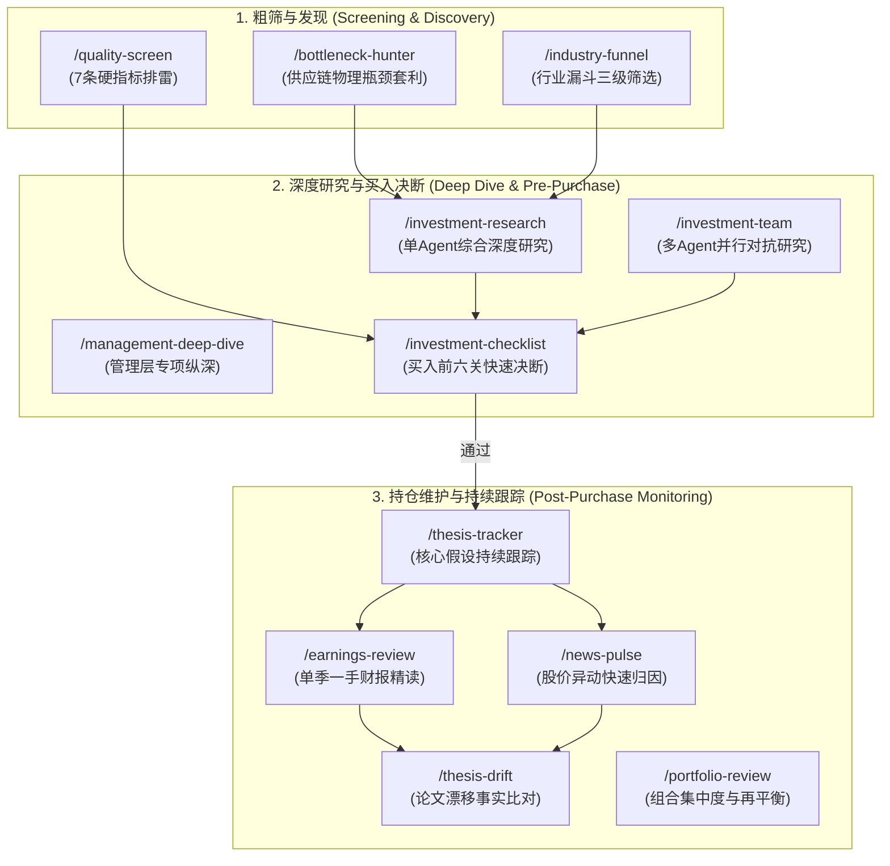

# ai-berkshire Source Harvest

## Capture metadata

- **Target repository**: `https://github.com/carllx/investment-lab`
- **Target Issue**: [#6 Evaluate ai-berkshire for investment research skills](https://github.com/carllx/investment-lab/issues/6)
- **External primary source repository**: `https://github.com/xbtlin/ai-berkshire`
- **Pinned source ref**: `fef5533145e2a505c7e07592d61165c7485a98b9` (Commit Date: 2026-08-22 18:42:40 +0800)
- **Working branch**: `research/external-guidance-pilot`
- **Base starting anchor**: `c305895c2adb06be2e109c07292240b98edb5fcb`
- **Captured date**: 2026-08-23
- **Research scope**:
  - 架构与指令层：`AGENTS.md`, `CLAUDE.md`, `README.md`
  - 投研流程与技能层：`skills/investment-research.md`, `skills/investment-checklist.md`, `skills/financial-data.md`, `skills/management-deep-dive.md`, `skills/industry-research.md`, `skills/earnings-review.md`, `skills/investment-team.md`, `skills/earnings-team.md`, `skills/thesis-drift.md`, `skills/thesis-tracker.md`, `skills/bottleneck-hunter.md`, `skills/quality-screen.md`, `skills/income-investment.md`, `skills/news-pulse.md`
  - 金融工具与准出校验层：`tools/financial_rigor.py`, `tools/terminal_value.py`, `tools/report_audit.py`, `tools/twstock_data.py`, `tools/ashare_data.py`, `tools/stock_screener.py`
  - 跨平台同步脚本：`scripts/sync-codex-skills.py`, `scripts/sync-codex-prompts.py`
- **Excluded scope (Authority Boundary)**:
  - 仓库内具体的实盘报告与文章（`reports/**`）
  - 静态资源与营销图片（`assets/**`）
  - README 与公众号中的自报投资收益（如 2024/2025 年 +69.29% / +66.38%）
  - 作者在具体股票上的买卖结论与盈亏事实（均标记为 `[Self-reported / Marketing]` 或 `[Example Output]`，不作为方法有效性证据）

---

## Architecture & research flow

### 1. 仓库整体架构与分层设计

[Source Fact]
依据 `README.md`（lines 161–175）与 `AGENTS.md`（lines 6–24），`ai-berkshire` 采用三层架构：
1. **Skill 层（20 个工作流入口）**：定义面向特定投研场景的端到端指令，规范输入参数、前置偏见检查、研究动作分解与输出格式。`skills/*.md` 是全仓库的 Canonical Workflow 唯一信源。
2. **Agent 层（并行调度与多视角对抗）**：在复杂场景（如 `/investment-team`, `/earnings-team`, `/news-pulse`）通过 Team Lead 调度 4–6 个子 Agent 并行执行独立检索、独立评估与交叉挑战；轻量级技能（如 `/quality-screen`, `/news-pulse`）则支持直连工具单 Agent 运行。
3. **工具层（确定性计算与质量准出）**：基于 Python 标准库构建零外部依赖的计算与审计工具（`tools/financial_rigor.py`, `tools/terminal_value.py`, `tools/report_audit.py` 等），承担精确十进制验算、多源交叉对比、永续增长终值约束审计与发布前 15% 随机抽检。

[Source Fact]
依据 `scripts/sync-codex-skills.py`（lines 64–90）与 `AGENTS.md`（lines 26–41）：
- 仓库通过自动化脚本将 `skills/*.md` 编译同步为 `codex-skills/*/SKILL.md` 与 `codex-prompts/*.md`，实现 Claude Code 命令与 OpenAI Codex Skill 包的单源多端分发。

[Interpretation]
- **通用架构价值**：将“LLM 的自然语言推理和信息提取”与“确定性 Python 计算引擎”、“独立质量准出闸门”物理分离，避免 LLM 在数值计算、倍数换算和折现公式中产生幻觉。
- **特定实现绑定**：其 Agent 调度基于 Claude Code 的 Task / Team API（如 `TeamCreate`, `TaskCreate`, `SendMessage`），并硬编码了本地路径约定（`~/ai-berkshire/tools/...`）与中文 Markdown 报告存储结构。

---

## Company-research decomposition

### 1. 公司研究动作拆解矩阵

[Source Fact]
依据 `skills/investment-research.md`（lines 1–276）与 `skills/investment-team.md`（lines 55–108），`ai-berkshire` 将“一家公司是否值得投资”拆解为 8 个串行/并行研究动作：

| 序号 | 研究动作 / 模块 | 核心解决的问题 | 关联输入与输出 | 驱动工具 / 规则 |
|---|---|---|---|---|
| **0** | **AI 研究偏见自觉** | 识别信息充裕度带来的虚假确定性与市场共识陷阱 | 输入公司名称与上市年限；输出 A/B/C 级评级与置信度声明 | A/B/C 评级表；C 级第一性原理清单 |
| **1** | **数据收集与程序化交叉验算** | 杜绝单源错误、时滞与 LLM 心算误差 | 输入股票代码；输出 5 年财报时序、最新股价、总股本、市值 | `financial-data.md` 优先级；`financial_rigor.py` 验算 |
| **2** | **商业模式与生意本质** | 穿透表象，评估商业模式是一次性还是持续复购，是轻资产还是重资产 | 输入拆解后的收入结构、毛利趋势；输出生意本质一句话定义与飞轮分析 | 段永平“好生意”三标准（差异化、定价权、可持续） |
| **3** | **竞争优势与经济护城河** | 评估未来 5–10 年超额收益能否被竞争对手侵蚀 | 输入 5 类护城河证据（品牌/转换成本/网络效应/规模/技术）；输出护城河趋势与 100 亿复制测试 | 巴菲特 5 维护城河评分（★1–5） |
| **4** | **逆向思考与风险清单** | 主动破坏投资假设，寻找公司死亡路径与市场做空逻辑 | 输入空方观点、历史相似公司案例、跨学科模型；输出失败路径概率矩阵 | 芒格“反过来想”；空方核心论点排查 |
| **5** | **管理层质量纵深研判** | 评估掌舵人的诚信度、战略眼光与历史资本配置效率 | 输入管理层历史承诺、回购/并购记录、股权治理结构；输出承诺兑现率与资本配置评分 | 承诺追踪表；CEO 离开情景推演 |
| **6** | **行业空间与产业位置** | 确认公司所处行业是否具备长期天花板，技术路线是否存在颠覆风险 | 输入 TAM、产业链上下游价值分配、集中度；输出价值链卡位与文明演进定位 | 李录文明演进与技术范式转移分析 |
| **7** | **估值与安全边际约束** | 计算内在价值与不同增长情景下的下行保护空间 | 输入 EPS、稳态 ROIC、资本成本 r、永续增速 g；输出三年三情景区间与十年折现 IRR | `financial_rigor.py three-scenario`；`terminal_value.py` 终值审计 |
| **8** | **综合决策备忘录与准出抽检** | 形成无歧义的行动指令，并对报告数据执行程序化抽样核验 | 输入各模块评分与结论；输出分层操作建议（激进/稳健/保守）与抽检判决 | 镜子测试；`report_audit.py` 15% 抽样（容差 ≤1%） |

[Interpretation]
- **研究动作的本质**：该拆解并不是简单的“提纲生成”，而是将传统的定性研报拆解为**有明确证伪条件和硬性约束的子任务**。每个动作均有明确的“打回”或“降级”机制（如数据不准打回、分母过窄打回、承诺兑现率低降级）。

---

## Evidence & source discipline

### 1. 证据阶梯与信源优先级

[Source Fact]
依据 `skills/financial-data.md`（lines 7–58）与 `skills/earnings-review.md`（lines 24–42），信源严格按照真实性与权威性分层：
1. **第一层（一手原始披露）**：
   - 美股：SEC EDGAR（10-K / 10-Q 原文）
   - 港股：HKEX 披露易（年报 / 中报 PDF）
   - A 股：巨潮资讯网（官方披露公告）
   - 台股：公开资讯观测站（MOPS）
2. **第二层（结构化主流数据聚合源 - 主/副双源）**：
   - 美股：`macrotrends.net`（主） + `stockanalysis.com`（副）
   - 港股：`aastocks.com`（主） + `macrotrends.net`（副，ADR 换算）
   - A 股：`eastmoney.com` 东方财富（主） + 巨潮资讯（副）
   - 台股：`FinMind API`（主，零依赖工具 `tools/twstock_data.py`） + `goodinfo.tw`（副）
3. **第三层（辅助与情绪源）**：
   - 业绩电话会纪要（Seeking Alpha / IR 页面）
   - 卖方研报、数据网站摘要、新闻媒体报道（仅用于线索发现，禁止直接作为财务结论权威）

### 2. 双源交叉验证与容差规则

[Source Fact]
依据 `skills/financial-data.md`（lines 67–78）及 `tools/financial_rigor.py`（lines 180–218）：
- 误差计算公式：
  $$\text{Error Rate} = \frac{|\text{Source}_1 - \text{Source}_2|}{\text{Source}_1} \times 100\%$$
- **容差分级处置**：
  - $\le 1\%$：判定一致（✅），采纳主源数值，报告中显式列出两源数据与误差比率；
  - $1\% \sim 5\%$：标记存在差异（⚠️），必须在报告中说明口径差异原因（如 GAAP vs Non-GAAP、汇率折算时点、财年定义、少数股东权益）；
  - $> 5\%$：标记重大差异（❌），严禁直接引用第三方数据，必须直接查阅原始披露文件（10-K/年报）进行仲裁。

### 3. 信息丰富度评级（A/B/C）与虚假确定性防御

[Source Fact]
依据 `skills/investment-research.md`（lines 9–34）与 `skills/investment-checklist.md`（lines 15–28）：
- **A 级（信息充裕）**：成熟大盘股。防御“共识陷阱”（AI 极易复述卖方共识），强制要求执行反共识检查与空方论点逆向测试。
- **B 级（信息适中）**：上市不久或覆盖有限标的。防御“合理推测填充”，所有推算指标必须显式标注置信度与推导链条。
- **C 级（信息稀缺）**：冷门股、初创企业。防御“数据多=确定性高，数据少=公司不好”的认知偏差。转入第一性原理提问（客户、复购、100 亿复制成本、关键决策），禁止为迎合报告格式而拼凑虚假数据。

[Durable Research Method]
- 建立“信息丰富度分级”与“双源交叉校验（1% 容差）”是任何 AI 投研系统都应长期采纳的证据纪律，能够从机制上扼杀 AI 编造财务数据与将共识当真理的倾向。

---

## Financial rigor

### 1. 消除浮点误差与手动验算纪律

[Source Fact]
依据 `tools/financial_rigor.py`（lines 24–105）：
- 所有财务计算强制使用 Python 标准库 `decimal.Decimal`（`Context(prec=28, rounding=ROUND_HALF_EVEN)`），彻底禁用 Python 原生 `float`，防止浮点数精度漂移。
- **市值强制验算**：必须输入当前股价 $P$ 与最新总股本 $S$，由脚本严格计算 $P \times S$ 并与外部报告市值对比。若偏差 $>5\%$ 触发硬告警（检查股本稀释/回购、AB 股双重股权结构、不同市场币种混淆）。

[Source Fact]
依据 `skills/financial-data.md`（lines 120–138）：
- **复权价格严谨性**：
  - 不复权：仅用于当前时点快照；
  - 前复权：用于历史股价对比、长期涨幅计算与历史 PE Band 评估；
  - 后复权：用于计算历史真实年化回报（含分红再投资）；
  - 严禁在同一分析中混用不同复权口径。

### 2. 永续增长模型（Terminal Value）的三大硬约束

[Source Fact]
依据 `skills/investment-research.md`（lines 173–238）与 `tools/terminal_value.py`（lines 1–238）：
十年期稳态退出估值严禁使用同业类比（避免将当前市场整体高估引入终值），必须采用永续增长公式：
$$PE_{\text{终值}} = \frac{1 - g/\text{ROIC}}{r - g}$$
其中 $1 - g/\text{ROIC}$ 为稳态派息率（$g/\text{ROIC}$ 为维持永续增速 $g$ 所需留存的资本比例），$r - g$ 为永续折现利差。

在将估值写入报告前，`tools/terminal_value.py audit` 强制执行三条硬约束准出检查（违背任一条直接打回）：
1. **约束 C1：资本成本 $r$ 与永续增速 $g$ 必须同币种匹配**：
   - 人民币口径：$r \in [6\%, 9\%]$（基准国债 $1.70\%$ + ERP），永续增速基准 $g \le 2.0\%$（长期名义 GDP 约束）；
   - 美元/港币口径：$r \in [9\%, 11.5\%]$（基准国债 $4.70\%$ + ERP），永续增速基准 $g \le 4.0\%$。
   - 严禁用人民币的折现率配美元的增速，或用美元的高折现率配过低的人民币增速。
2. **约束 C2：分母利差 $r - g \ge 5\text{ 个百分点}$（有效性下限）**：
   - 当 $r - g < 5\%$ 时，永续增长模型对 $g$ 的微小变动极度敏感，估值会急剧发散，属于放大偏见而非理性定价；$r - g \le 0$ 时模型直接失效。
3. **约束 C3：离散风险（如退市、VIE 结构失效、地缘断供、行业毁灭性监管）严禁折算进折现率 $r$ 或 $\beta$**：
   - **理论依据**：提高折现率 $r$ 对第 10 年现金流的惩罚是第 1 年的 2.6 倍以上，而退市或地缘风险是均匀甚至前置的年度危害率（Hazard Rate）。在折现率中叠加风险溢价会**系统性颠倒风险在时间维度上的分布**。
   - **合规做法**：离散风险必须在情景分析中设立独立的“尾部情景档”并赋予发生概率。

### 3. 报告数据抽检准出机制（Report Audit Gate）

[Source Fact]
依据 `skills/investment-research.md`（lines 275–315）与 `tools/report_audit.py`（lines 1–300）：
- 报告生成后不得直接视为定稿，必须运行 `tools/report_audit.py extract` 从 Markdown 正文与表格中解析所有财务数据点，按 $15\%$ 比例（最少 3 个，最多 30 个）进行随机抽样。
- 对抽样清单从一手/主备信源重新核验取数，填入验证 JSON，运行 `tools/report_audit.py verdict`：
  - **准出（PASS）**：所有抽检数据点相对偏差 $\le 1\%$；
  - **打回（FAIL）**：存在任意一个数据点偏差 $>1\%$，必须修正报告对应数据后重新抽检，直至完全准出。

[Durable Research Method]
- “Decimal 精确计算”、“复权口径统一”、“永续增长三约束（同币种匹配、5% 最小分母利差、离散风险禁止进折现率）”以及“发布前 15% 随机抽样准出”具有极高的金融工程严谨性，属于跨流派通用的硬核资产。

---

## Anti-bias / falsification mechanisms

### 1. 逆向思考与可证伪性机制分类

[Source Fact]
依据 `skills/investment-research.md`, `skills/investment-checklist.md`, `skills/quality-screen.md`, `skills/thesis-drift.md`：
仓库内置了多层次的反偏见机制。依据其属性进行严格分类：

| 机制名称 | 核心逻辑与操作规范 | 属性分类 | 适用范围与局限 |
|---|---|---|---|
| **芒格式逆向检验 (Inversion)** | 强制列出“公司可能失败的所有路径”及概率，寻找历史上处于相似位置公司的毁灭结局 | `[Durable Research Method]` | 适用于所有投资研究，防止过度乐观叙事 |
| **反共识排查 (Counter-Consensus)** | 强制调研“聪明人为什么做空或不买”，寻找被市场主流忽视的结构性缺陷 | `[Durable Research Method]` | 避免 AI 输出沦为卖方共识的复述 |
| **快速否决清单 (Fast Rejection)** | 8 条一票否决红线（说不清商业模式、3 年连续负 FCF、管理层诚信污点、不可逆护城河侵蚀等） | `[Value-Investing Preference]` | 偏好现金流与护城河型企业，可能误杀高研发、高投入的早期硬科技与成长企业 |
| **镜子测试 (Mirror Test)** | 强制用 5 句话写出买入逻辑（本质、护城河、管理层、安全边际、下行保护），写不完整直接判定不买 | `[Value-Investing Preference]` | 强调极度清晰的确定性，不适用于多因子/量化统计套利 |
| **论文漂移三值判定** | 对比两份报告时，仅依据可验证证据判定核心假设与红线的 Improved / Unchanged / Weakened | `[Durable Research Method]` | 严格区分“事实变化”、“价格波动”与“文风措辞改写” |
| **留白原则 (Embrace Uncertainty)** | 数据不足时诚实标注“灰色地带”与“低置信度”，禁止用模型推测伪造确定性 | `[Durable Research Method]` | AI 研究的核心安全护栏 |
| **强制结论与买卖建议** | 强制给出“买入/持有/观望/减仓”及具体分层建议价格区间 | `[Author Preference / Heuristic]` | 带有较强的主观投资倾向，不应作为自动化研究的强制通用标准 |

[Interpretation]
- 价值投资偏好（如极度厌恶亏损、要求 10 年确定性、强调安全边际）为框架注入了严苛的筛选标准，但不能将“买入必须有 5 折安全边际”等同于客观的研究方法。通用的部分是其**证伪结构（定义假设 $\to$ 设定追踪指标 $\to$ 监测破坏条件 $\to$ 触发动作）**。

---

## Management / industry / earnings research

### 1. 管理层纵深研究（Management Deep Dive）

[Source Fact]
依据 `skills/management-deep-dive.md`（lines 1–283）：
- **核心动作**：
  1. **承诺 vs 兑现追踪**：从过去 3 年财报、电话会及股东信中提取管理层的具体量化承诺，比对后续实际兑现情况，统计兑现率（$>80\%$ 优秀，$<40\%$ 严重问题）。
  2. **逆境表现复盘**：分析公司在股价暴跌、业绩失误或监管冲击时的反应（主动沟通 vs 躲避；内部归因 vs 外部甩锅）。
  3. **资本配置四维度审计**：逐笔评估过去 5 年的并购纪录（事后整合与商誉减值）、回购时机（高估时停止、低估时回购）、分红与 FCF 匹配度、新业务投资的止损纪律。
  4. **组织去中心化检验**：“如果 CEO 明天退休/发生意外，公司能否凭借组织体系保持核心竞争力？”

### 2. 行业全景扫描与瓶颈猎手（Industry & Bottleneck Hunter）

[Source Fact]
依据 `skills/industry-research.md`（lines 1–269）与 `skills/bottleneck-hunter.md`（lines 1–150）：
- **逻辑链构建与反思**：画出从“底层超级趋势 $\to$ 衍生需求 $\to$ 产生物理瓶颈 $\to$ 受益环节”的因果箭头，并寻找已签约、已落地的商业事实进行环节验证。
- **供应链分层解构**：将概念拆解到物理实体（Layer 0 终端应用 $\to$ Layer 1 核心组件 $\to$ Layer 2 子组件/材料 $\to$ Layer 3 设备/原料 $\to$ Layer 4 基础设施）。指出 Layer 1 定价充分、Alpha 有限，真正的 Alpha 集中在 Layer 2/3 的物理卡脖子环节。
- **瓶颈判定 6 条硬标准**：供给集中度（$\le 2$ 家）、扩产周期（$>2$ 年）、替代难度（不可替代）、产能利用率（$>90\%$）、需求增速（$>50\%$）、客户验证周期（$>1$ 年）。满足 $\ge 4$ 条判定为 S 级单点故障瓶颈。

### 3. 财报精读（Earnings Review）

[Source Fact]
依据 `skills/earnings-review.md`（lines 1–219）：
- **拒绝二手研报**：强制从交易所披露平台提取一手 10-K/10-Q/年报与业绩电话会 Q&A 纪要。
- **附注与隐藏信息挖掘**：必查关联交易公允性、股权激励（SBC）稀释率、表外或有负债、会计政策与折旧年限变更、好业务补贴坏业务的分部信息、客户集中度。
- **异常财务信号检测**：应收账款增速 $>$ 收入增速（塞渠道）、存货增速 $>$ 收入增速（积压）、经营现金流 $<$ 净利润且差距扩大（利润质量劣化）、资本化开支骤增（粉饰利润）。

[Durable Research Method]
- “承诺兑现追踪”、“资本配置历史审计”、“物理供应链分层瓶颈扫描”和“财报附注异常信号检测”是极具实操性的深度基本面研究方法，完全摆脱了空泛的行业概述。

---

## Thesis tracking / change detection

### 1. 投资论文的结构化建档（Thesis Tracker）

[Source Fact]
依据 `skills/thesis-tracker.md`（lines 1–211）：
- **买入前写定卖出条件**：在建仓时创建 `reports/{公司名}-thesis.md`，固化四大结构：
  1. **核心论文（5 句话）**：生意本质、护城河状态、管理层可信度、估值折扣、下行保护；
  2. **核心假设清单（3–7 条）**：可量化验证的指标（如收入增速 $\ge 15\%$、毛利率 $\ge 60\%$、持续回购）；
  3. **红线清单（一票否决条件）**：如管理层造假、核心业务连续 2 季萎缩、护城河被明确突破；
  4. **估值锚点与追踪记录表**。

### 2. 投资论文漂移检测（Thesis Drift）

[Source Fact]
依据 `skills/thesis-drift.md`（lines 1–211）：
- **区分三类变化**：
  - **事实改变**：业务数据、竞争壁垒、资本配置发生实质改变（驱动论文漂移）；
  - **价格改变**：估值倍数与市场情绪波动，不影响基本面质量；
  - **措辞改变**：新旧报告文风与表述差异，禁止误判为论文漂移。
- **三值判定状态机**：
  - 在估值锚点、核心假设、红线清单、管理层质量、竞争护城河 5 个维度上，严格只能给出 **Improved / Unchanged / Weakened** 三种判定。
  - 判定必须引用财报行项目、监管披露或确凿事件作为触发证据；若无新事实，一律判定为 Unchanged。

[Durable Research Method]
- 将投资假设解构为“前置核心假设 + 触发红线”，并以“三值状态机”对新事实进行增量审计，是防范持仓认知偏差与情绪化交易的优秀工程实践。

---

## Multi-Agent architecture

### 1. 多 Agent 并行投研机制分析

[Source Fact]
依据 `skills/investment-team.md`（lines 1–230）与 `skills/earnings-team.md`（lines 1–445）：
- **团队构成与分工**：
  - `team-lead`：总协调、冲突裁决与报告定稿；
  - `business-analyst`（段永平视角）：聚焦商业模式、用户价值与护城河；
  - `financial-analyst`（巴菲特视角）：聚焦三张表质量、现金流真实性与估值安全边际；
  - `industry-researcher`（芒格视角）：聚焦行业格局、竞争威胁与逆向失败路径；
  - `risk-assessor`（李录视角）：聚焦管理层诚信、附注隐藏风险与长期文明演进；
  - `earnings-team` 额外引入 `editor`（面向公众表达润色）与 `reader-reviewer`（普通投资者挑刺）。

### 2. 多 Agent 架构的实质价值来源评估

[Interpretation]
基于源码事实，对多 Agent 的真实价值与成本进行客观评估：

1. **真实价值点**：
   - **并发上下文隔离（Context Window Decoupling）**：单 Agent 串行检索易导致上下文溢出、注意力稀释或提前得出结论；4 个 Agent 并行各跑独立的 Web 检索与数据提取，有效扩大了信息捕获半径。
   - **提示词引导的专业视角分化**：财务 Agent 强制调用 `financial_rigor.py` 验算，风险 Agent 专门扫描诉讼与附注，使各子任务聚焦于专用领域，避免泛泛而谈。
   - **共识与矛盾显式暴露**：Team Lead 的核心职责是提取各视角的冲突（例如巴菲特视角认为估值极低，而李录视角认为管理层不可信；段永平视角看好商业模式，而芒格视角指出竞争对手正在快速侵蚀），这种冲突揭示了决策的核心张力。
2. **形式化过度与局限（Persona Theater）**：
   - **角色包装大于实质隔离**：4 个 Agent 均使用相同的底层通用模型（`general-purpose`），其“大师视角”主要依赖 System Prompt 的人格化设定（穿插语录点评）。如果没有差异化的数据输入或专有工具，容易沦为人格化表演。
   - **Token 消耗与冗余检索**：4 个 Agent 独立搜索同一家公司时，存在大量重复抓取（如重复抓取同一份财报基本数据）。
   - **权限静默退化风险**：`investment-team.md`（lines 34–48）指出，当后台 Agent 缺失 WebSearch 权限时，由于无法交互式确认，会静默退化为基于陈旧训练知识作答，生成虚假的“深度报告”。

[Durable Research Method] vs [Implementation-Specific]
- **可迁移架构**：针对复杂标的采用“数据采集 $\to$ 独立子领域分析（商业/财务/风险） $\to$ Lead 综合裁决”的多任务并行解耦模式是有效的。
- **应精简部分**：应剥离大师语录扮演、编辑/读者等营销层 Agent，使 Agent 专注于客观事实提取与风险对抗。

---

## Skill-boundary lessons

### 1. 技能拆分原则与边界逻辑

[Source Fact]
依据 `README.md`（lines 176–228）与各技能文件定义，`ai-berkshire` 将投研技能按生命周期与场景颗粒度切分：

[Interpretation]
- **边界划分的合理性**：
  - **轻重分离**：将 10 分钟快速排雷（`quality-screen`, `investment-checklist`）与高耗时、高 Token 消耗的深度研究（`investment-team`）分开，避免在劣质标的上浪费计算资源。
  - **静态与动态分离**：将公司首次建仓深度研究（`investment-research`）与持仓期间的事件驱动跟踪（`earnings-review`, `news-pulse`, `thesis-drift`）分开，保证持仓跟踪只关注“增量事实”。
  - **标的与组合分离**：将单资产基本面研究与组合层面的权重分配（`portfolio-review`, `income-investment`）清晰解耦。

---

## Durable methods vs value-investing worldview

### 1. 通用方法 vs 流派偏好 vs 具体实现全景矩阵

| 方法 / 机制 | Primary Source | Durable? | Style-specific? | Implementation-specific? | Potential `investment-lab` Use | Risk / Caveat |
|---|---|:---:|:---:|:---:|---|---|
| **信息丰富度分级 (A/B/C) 与留白原则** | `investment-research.md:L9-34` | **YES** | 否（通用） | 部分（A/B/C 划分） | 制定 Agent 基本面研究的数据置信度前置门禁 | 防止 AI 将冷门/数据少直接误判为“不合格” |
| **多源财务交叉验证 (<1% 容差)** | `financial-data.md:L61-98`, `financial_rigor.py:L180` | **YES** | 否（通用） | 是（指定了具体爬虫与数据站） | 制定统一的资产数据接入与校验标准规范 | 需适配本地可用数据源（如聚宽、Tushare、本地 Parquet） |
| **精确十进制运算与市值验算** | `financial_rigor.py:L28,74` | **YES** | 否（通用） | 否（纯 Python 标准库） | 投研工具库强制采用 Decimal 消除浮点误差与单位混淆 | 无 |
| **永续增长估值三硬约束 (C1/C2/C3)** | `terminal_value.py:L11-23,124-138` | **YES** | 否（适用于所有 DCF/终值模型） | 否（金融数学逻辑） | 估值与资产定价模型中的参数合规性校验引擎 | 早期未盈利或强周期企业需适配不同终值模型 |
| **发布前 15% 随机抽样准出 (Audit Gate)** | `report_audit.py:L246-286` | **YES** | 否（通用质量工程） | 是（正则表达式解析 md 表格） | 投研报告与回测分析自动化质检准出流程 | 正则解析依赖 Markdown 固定排版格式 |
| **承诺 vs 兑现追踪 (Say-Do Tracker)** | `management-deep-dive.md:L74-91` | **YES** | 否（通用） | 否（结构化表格） | 管理层研究、基金经理尽调、分析师预测质量追踪 | 历史承诺文本抓取的完整性依赖数据源覆盖 |
| **物理供应链分层瓶颈扫描** | `bottleneck-hunter.md:L56-132` | **YES** | 否（产业逻辑） | 否（分层分析法） | 产业链研究、主题投资挖掘、风险传导分析 | 需行业专家先验知识校准实体层级 |
| **投资论文增量漂移检测 (Improved/Unchanged/Weakened)** | `thesis-drift.md:L92-115` | **YES** | 否（通用） | 否（三值状态机） | 策略/持仓定期跟踪，区分价格波动与基本面恶化 | 需先建立标准化的初始假设基线 |
| **一手财报附注异常信号检测** | `earnings-review.md:L127-147` | **YES** | 否（通用财会） | 否（审计检查项） | 财报季自动化财报异动排雷与盈利质量评分 | 需直接获取原始披露全文 |
| **巴菲特/芒格/段永平 4 大师人格化对抗** | `investment-team.md:L119-144` | **NO** | **YES**（纯价值投资流派） | 是（Claude Prompt 包装） | 不建议直接引入人格，可借鉴“商业/财务/竞争/风险”四维解耦 | 人格化容易导致空泛语录复述与形式主义 |
| **快速否决红线（3年负 FCF、低毛利一票否决）** | `investment-checklist.md:L190-204` | **NO** | **YES**（传统价值投资） | 否（规则清单） | 可作为价值投资策略子集的筛选条件 | 严禁作为全实验室的通用规则，否则会扼杀成长股与周期股 |
| **强制 10 年确定性要求与 5 折安全边际** | `investment-checklist.md:L157-163` | **NO** | **YES**（深度价值流派） | 否（主观偏好） | 仅适用于低风险长线配置池 | 对科技创新、动量与统计套利策略完全不适用 |
| **微信公众号文章生成与读者评审** | `earnings-team.md:L287-386` | **NO** | 否（自媒体内容生产） | 是（针对公众号排版与传播） | 不纳入 investment-lab 投研核心 | 属于内容营销层，非投资研究本身 |

---

## What investment-lab should NOT inherit automatically

### 1. 明确禁止直接继承的范畴

1. **营销与自报业绩（Marketing & Self-Reported Track Record）**：
   - `[Self-reported / Marketing]`：README 中声称的 2024 年 $+69.29\%$、2025 年 $+66.38\%$ 收益截图、微信公众号「复利炼丹炉」引流等内容，属于宣传与个人实盘，严禁作为 investment-lab 方法论有效性的依据。
2. **大师人格扮演与语录剧场（Persona Theater over Substance）**：
   - 模拟巴菲特、芒格、段永平、李录的“口吻”和“点评”，虽然增加了报告可读性，但容易消耗 Token 并产生看似深刻实则同义反复的文本。investment-lab 应追求**客观的事实、数据、因果逻辑与统计置信度**，而非大师语录。
3. **主观打星评分机制（Subjective 1–5 Star Rating）**：
   - 框架中大量出现 ★1–5 星评分（如能力圈、好生意、护城河），但评分缺乏严格的数学映射与连续标定，极易受 LLM 提示词随机性影响。投资决策不应依赖伪量化的星级平均分。
4. **价值投资偏好的硬规则泛化（Over-generalized Value Dogmas）**：
   - 将“连续 3 年 FCF 为负直接否决”、“毛利率 $<15\%$ 视为无定价权”等价值投资经验法则设为通用排雷规则，会系统性错失处于重资产扩张期、研发投入期或高周转薄利模式（如早期的电商、半导体晶圆厂、仓储零售）的优质标的。
5. **强耦合的本地路径与工具链绑定（Hardcoded Tooling & Local Paths）**：
   - 上游代码强绑定 `~/ai-berkshire/tools/...` 绝对路径，且深度依赖特定外部网站的网页结构（如 aastocks、macrotrends），容错性较弱。
6. **自媒体发布工作流（Content Publishing Pipeline）**：
   - 编辑 Agent（公众号改写）与读者评审 Agent（可读性挑刺）服务于面向 C 端的自媒体分发，与 investment-lab 面向专业量化、策略回测与资产配置的定位无关。

---

## Candidate future local Skills

> **声明**：以下仅为基于本次 Source Harvest 提炼的未来本地 Skill 候选提案（Candidate Only），本轮**严禁创建任何 Skill 文件**，仅供后续架构决策参考。

### 1. `company-research`（单公司基本面深度研究）
- **核心定位**：继承其“偏见评级 $\to$ 双源财务采集 $\to$ 商业模式 $\to$ 竞争格局 $\to$ 风险排查 $\to$ 永续估值约束 $\to$ 数据抽检准出”的严密闭环，去除大师人格包装，输出结构化事实报告。

### 2. `thesis-tracker` / `thesis-monitor`（投资假设生命周期监控）
- **核心定位**：在标的买入/入池时固化“核心量化假设”与“证伪红线”；在后续财报或重大事件时，执行增量漂移检测（Improved / Unchanged / Weakened），严格区分事实变化与价格波动。

### 3. `earnings-review`（一手财报深度精读）
- **核心定位**：专注交易所一手披露文件，自动化提取三张表真实数据、核对管理层前期承诺兑现情况、排查附注异常会计信号（应收/存货/SBC/关联交易）。

### 4. `management-audit`（管理层历史行为与资本配置审计）
- **核心定位**：量化追踪管理层“言行一致性（承诺兑现率）”、历史重大并购整合回报、回购时机合理性与股权稀释治理。

### 5. `financial-rigor`（金融计算与数据验证标准工具库）
- **核心定位**：沉淀 Decimal 精确计算、市值交叉核算、永续增长终值约束审计（C1/C2/C3）、报告发布前 15% 随机抽检等确定性 Python 工具。

---

## Open questions

1. **数据源本地化与合规性**：
   - `ai-berkshire` 依赖 curl 直连海外/公开网站（如 Macrotrends, Yahoo, 东方财富）。`investment-lab` 是否应封装统一的 `DataProvider` 接口，优先读取本地量化数据库（如 Qlib bin、Parquet、DuckDB 或本地 API），仅在数据缺失时调用 WebSearch 补充？
2. **多 Agent 协作的成本效益比**：
   - 在真实投研环境中，4 个后台 Agent 并行调研单家公司的 Token 消耗较大。`investment-lab` 应如何设计调度分级（例如：初筛采用单 Agent + 规则引擎，仅对进入重点观察池的标的触发多视角对抗）？
3. **估值模型的多元化适配**：
   - `terminal_value.py` 的 Gordon 永续增长模型适用于稳态成熟期企业。对于科技成长型企业、周期性资源品、生物医药以及金融类资产，如何扩展对应的严谨估值校验规则（如 PS-Growth、SOTP、NAV、重置成本法）？

---

## Primary-source index

本报告所有核心结论均严格追溯自外部权威源 `https://github.com/xbtlin/ai-berkshire`，Pinned Commit Ref: `fef5533145e2a505c7e07592d61165c7485a98b9`。

| 模块 / 主题 | 原始文件路径 | 关键行号 / 章节 | 核心事实与证据 |
|---|---|---|---|
| **架构与质量准则** | `AGENTS.md` | lines 1–70 | 规范 Codex/Claude 双端同步规则、数据基准日确认、双源校验与报告审计流程 |
| **指令与全局原则** | `CLAUDE.md` | lines 68–113 | 投研分析最高原则（客观、区分事实与观点、不预设立场、双源交叉验证） |
| **公司深度研究闭环** | `skills/investment-research.md` | lines 9–34, 55–99, 173–238, 275–315 | A/B/C 偏见评级、数据交叉验算、永续增长 10 年估值审计、15% 抽检准出 |
| **买入前检查与否决** | `skills/investment-checklist.md` | lines 48–173, 175–204 | 六关 Checklist、镜子测试 5 句话法则、8 条快速一票否决红线 |
| **财务数据规范** | `skills/financial-data.md` | lines 7–58, 61–98, 120–138 | 美/港/A/台股主备数据源优先级、1% 容差处理阶梯、前/后复权口径规范 |
| **多 Agent 投研团队** | `skills/investment-team.md` | lines 11–18, 34–48, 55–108, 119–144 | 4 大师视角分工、WebSearch 权限预检（防止静默退化）、Team Lead 冲突合成 |
| **一手财报精读** | `skills/earnings-review.md` | lines 24–42, 94–147, 182–188 | 拒绝二手研报、MD&A 语气与承诺追踪、附注隐藏信息与异常信号排查 |
| **财报团队与自媒体** | `skills/earnings-team.md` | lines 43–54, 240–285, 287–386 | 6 Agent 财报研判、Team Lead 寻找矛盾点、编辑改写与读者评审流程 |
| **管理层纵深研究** | `skills/management-deep-dive.md` | lines 25–44, 74–91, 118–158, 258–269 | 承诺 vs 兑现统计表、危机复盘、资本配置四维审计（并购/回购/分红/投资） |
| **产业链全景扫描** | `skills/industry-research.md` | lines 16–39, 41–62, 64–81, 198–220 | 逻辑链构建与落地事件验证、产业链绘制、行业偏见自觉、组合分层配置 |
| **供应链瓶颈套利** | `skills/bottleneck-hunter.md` | lines 17–53, 56–100, 112–132 | 超级趋势确认、0–4 层物理供应链拆解、瓶颈判定 6 条硬标准（S 级识别） |
| **投资论文追踪** | `skills/thesis-tracker.md` | lines 42–82, 124–149, 174–187 | 买入前建立 5 句话论文+假设清单+红线清单、论文健康度定量评分 |
| **投资论文漂移检测** | `skills/thesis-drift.md` | lines 14–24, 40–67, 92–115, 142–150 | 区分事实/价格/措辞变化、证据归一化、5 维度 Improved/Unchanged/Weakened 判定 |
| **7 条去劣硬指标** | `skills/quality-screen.md` | lines 24–35, 36–64 | 7 条硬指标（ROE<8%、5年负FCF等）与 3 条豁免规则（投入期/低净利/高周转） |
| **收益型资产分析** | `skills/income-investment.md` | lines 36–43, 52–78, 93–100 | 分红可持续性分析、行业分部指标（REIT/银行/公用事业）、组合适配检查 |
| **股价异动快速归因** | `skills/news-pulse.md` | lines 18–32, 54–108 | 4 视角快速情报响应（公司/监管/对手/情绪）、10 分钟快速异动归因 |
| **精确十进制金融工具** | `tools/financial_rigor.py` | lines 28–38, 74–105, 180–218, 224–295 | `Decimal` 引擎、市值验算、多源交叉对比（容差 2%）、Benford 定律造假检测 |
| **终值与十年估值工具** | `tools/terminal_value.py` | lines 6–23, 70–72, 124–138, 144–170 | 永续增长模型、分母 $\ge 5\%$ 下限、C1/C2/C3 硬约束审计与敏感性扫描 |
| **报告抽检准出工具** | `tools/report_audit.py` | lines 47–71, 172–244, 246–255, 260–300 | 正则数据点提取、15% 随机抽样算法、1% 容差 PASS/FAIL 判决引擎 |
| **台股/A股专用工具** | `tools/twstock_data.py`, `tools/ashare_data.py` | `twstock_data.py:1-60`, `ashare_data.py:1-60` | FinMind API 零依赖封装、月营收追踪、腾讯/东财 A 股行情解析 |
| **跨端同步机制** | `scripts/sync-codex-skills.py` | lines 16–61, 64–90, 92–134 | Claude Code 技能到 Codex Skill 包的单源编译与元数据生成 |
