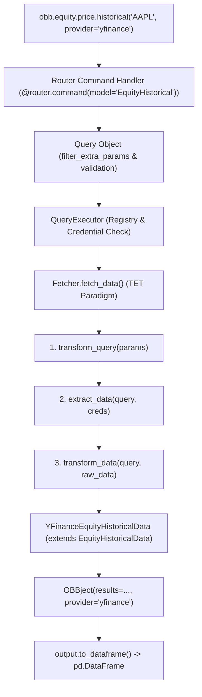

# OpenBB Source Harvest

## Capture metadata

- **Repository**: `https://github.com/OpenBB-finance/OpenBB`
- **Main ref used**: `3e071fcc2cd9f891cac6040ae60296dba76dab46` (develop branch HEAD)
- **Repository Version**: `4.7.3` (`openbb_platform/pyproject.toml`)
- **Captured date**: 2026-08-23
- **Target issue**: [#5 Evaluate OpenBB as financial data infrastructure](https://github.com/carllx/investment-lab/issues/5)
- **Status**: Read-only source harvest for Browser Guidance preparation

---

## ODP vs Workspace vs data providers

[Source Fact — Pinned]
依据 `README.md` 与 `openbb_platform/` 源码结构，OpenBB 生态在物理与逻辑上被明确划分为三个层次：
1. **Open Data Platform (ODP)**: 位于开源仓库核心（`openbb_platform/`），提供 Python 数据获取基础设施、统一模型定义（`StandardModel`）、路由分发引擎、FastAPI 驱动的 REST API（`openbb-api`，默认端口 `127.0.0.1:6900`）以及 MCP 服务扩展（`openbb-mcp-server`）。
2. **OpenBB Workspace**: 官方商业化企业级 Web UI 与分析师工作台（`https://pro.openbb.co`），提供图表看板与 AI Agent Copilot。ODP 仅作为 Workspace 的本地或远程数据后端（通过 `Connect backend` 连接）。
3. **Third-party Data Providers**: 外部实际数据供应方（如 SEC, FRED, FMP, Intrinio, Tiingo, Yahoo Finance 等）。OpenBB 仅提供开源连接器（Connectors/Fetchers），不托管、不拥有也不重新分发原始数据。

[Commercial / Licensing Boundary]
- **核心边界澄清**：“OpenBB 开源”仅代表其连接器与集成框架开源（AGPLv3）。
- **数据授权独立**：通过 OpenBB 获取的数据受各供应商独立的 Terms of Service、API 配额与商业许可约束。使用 OpenBB 不等于获取免费或无需授权的金融数据。

---

## Architecture: command → provider → standard model → result

[Source Fact — Pinned]
以调用 `obb.equity.price.historical(symbol="AAPL", provider="yfinance")` 为例，完整请求执行链路由以下 7 个步骤构成：



1. **统一命令入口与路由分发** (`openbb_core/app/router.py`, `extensions/equity/.../price_router.py`):
   - 路由函数声明为 `@router.command(model="EquityHistorical")`，接收 `CommandContext`、`ProviderChoices`、`StandardParams` 与 `ExtraParams`。
2. **查询封装与参数过滤** (`openbb_core/app/query.py`):
   - `Query` 对象通过 `filter_extra_params()` 检查传入参数是否属于目标 provider，若包含该 provider 不支持的额外参数，记录 `OpenBBWarning` 并自动剔除。
3. **查询执行器与凭据校验** (`openbb_core/provider/query_executor.py`):
   - `QueryExecutor.execute()` 从 `Registry` 获取指定 provider 及对应的 `Fetcher` 类；
   - 调用 `filter_credentials()` 校验并注入用户配置的 API Key（若该 fetcher 声明 `require_credentials=True` 且缺失对应密钥，抛出 `OpenBBError`）。
4. **Fetcher 的 TET 执行范式** (`openbb_core/provider/abstract/fetcher.py`):
   - **T (Transform query)**: `cls.transform_query(params)` 将通用标准参数转换为供应商特有的查询模型（如 `YFinanceEquityHistoricalQueryParams`）；
   - **E (Extract data)**: `cls.extract_data(query, credentials)` 调用外部 API 或底层客户端（如 `yf_download` 或 HTTP 请求）获取原始数据；
   - **T (Transform data)**: `cls.transform_data(query, data)` 清洗原始数据，映射字段，并实例化为标准数据模型列表。
5. **标准数据模型映射** (`openbb_core/provider/standard_models/equity_historical.py`):
   - `EquityHistoricalData(Data)` 预定义标准字段：`date`, `open`, `high`, `low`, `close`, `volume`, `vwap`。
   - 具体实现类（如 `YFinanceEquityHistoricalData`）继承 `EquityHistoricalData`，并可附带专属字段（如 `split_ratio`, `dividend`）。
6. **结果包装** (`openbb_core/app/model/obbject.py`):
   - 返回统一的 `OBBject[List[YFinanceEquityHistoricalData]]` 容器，封装 `results`, `provider`, `warnings`, `chart`, `extra` 等元数据。
7. **下游消费转换** (`OBBject.to_dataframe()`):
   - 通过 `basemodel_to_df` 将 Pydantic 对象序列化并构造为 `pandas.DataFrame`，自动设置指定索引（默认 `date`）。

---

## Provider abstraction

[Source Fact — Pinned]
依据 `query_executor.py`、`registry_map.py` 与 `data.py`：
1. **多 Provider 支持**: 同一 endpoint 可以在运行时显式指定不同 provider（例如 `provider="yfinance"`、`provider="fmp"`、`provider="intrinio"`），前提是该 provider 在其 `fetcher_dict` 中注册了对应的 StandardModel。
2. **数据标准化与字段继承**: 所有 Provider 的返回数据类均继承自相同的 `StandardModel`。标准字段在不同供应商之间保证名称与基本类型对齐。
3. **Provider-specific 专有字段与泄露 (Abstraction Leakage)**:
   - 基础模型 `Data` 声明 `model_config = ConfigDict(extra="allow")`；
   - 各 Provider 可以自由定义专属字段（例如 yfinance 提供 `split_ratio`，FMP 提供 `unadjusted_volume`）；
   - 转换到 DataFrame 时，所有专有字段均会被保留为 DataFrame 的额外列；
   - **上层影响**：若实验代码使用了某 Provider 的专有列，更换 Provider 将引发 `KeyError`。
4. **不支持与参数异常处理**:
   - 若请求的 Provider 不支持该 Model，`QueryExecutor` 立即抛出 `OpenBBError(f"Fetcher not found for model '{model_name}' in provider '{provider.name}'.")`；
   - 若传入了不支持的参数，`Query` 发出 `OpenBBWarning` 并静默忽略不支持的字段。
5. **无自动 Fallback / Retry 机制**:
   - OpenBB 内部**完全没有** Provider 链式回退（Fallback Chain）或自动重试机制；
   - Provider 路由是单次硬分发。一旦所选 Provider 发生网络错误、Rate Limit (429)、认证失败或解析异常，直接向调用方抛出异常；
   - 任何多源容灾或降级重试必须由上层实验代码显式通过 `try...except` 编写。

[Architecture Capability vs Automatically Guaranteed Behavior]
- **架构能力 (Architecture Capability)**: 提供了统一的多源契约定义标准与插件化接入机制。
- **自动保证行为 (Automatically Guaranteed Behavior)**: 仅保证单次请求的静态类型分发与参数校验，**不保证**运行时服务高可用、跨源数据一致性、历史跨度对齐或自动容灾。

---

## Representative provider inventory

[Source Fact — Pinned]
当前 commit（`3e071fcc2cd9f`）中共内置 **32 个 Provider 扩展包**。以下为 6 大代表性分类及核心清单：

| Provider | 主要数据类别 | 凭据需求 (Credentials) | 开源连接器 | 数据访问费用与条款 (Captured: 2026-08-23) | 主要市场 | investment-lab 潜在用途 |
| :--- | :--- | :--- | :--- | :--- | :--- | :--- |
| **`yfinance`** | Equity, ETF, Index, Crypto, Currency, Futures | Keyless (无) | 是 (`openbb-yfinance`) | [Live Fact] 免费公开爬虫，无 SLA 保证，高频易被 Yahoo 限流/封 IP | 美股 / 全球 / 部分 A/H 股 | 美股与全球指数基准无成本快速摸底 |
| **`sec`** | Company Filings, 10-K/10-Q, Insider Trading, Form 13F | Keyless (需 User-Agent) | 是 (`openbb-sec`) | [Live Fact] 免费公共数据 (SEC EDGAR)，受 10 req/s 速率限制 | 美股上市公司 | 美股财报披露、基本面核验与机构持仓 |
| **`fred`** | 宏观经济时序 (CPI, GDP, 利率, 货币供应量) | Free API Key (`fred_api_key`) | 是 (`openbb-fred`) | [Live Fact] 免费注册获取 Key，无直接费用，覆盖美联储 80+ 万条时序 | 美国 / 全球宏观 | 宏观经济周期、无风险利率与资产定价因子 |
| **`fmp`** (Financial Modeling Prep) | Equity 财务全量、比率、估值、估算、分红 | API Key (`fmp_api_key`) | 是 (`openbb-fmp`) | [Live Fact] 基础免费版每日限 250 次且功能受限；全量财报/国际数据需商业订阅 ($19~$99+/月) | 美股为主 / 部分国际市场 | 美股历史基本面多因子与估值指标 |
| **`intrinio`** | Equity, Options, Fundamentals, Real-time feeds | API Key (`intrinio_api_key`) | 是 (`openbb-intrinio`) | [Live Fact] 纯商业数据供应商，按数据集收费 (通常 $100+/月)，企业级 SLA | 美股 / 期权 | 机构级美股回测与高质量清洗后基本面 |
| **`cboe`** | 波动率指数 (VIX, RVX, OVX), 期权与指数数据 | Keyless (无) | 是 (`openbb-cboe`) | [Live Fact] 免费延迟公开数据 | 美国衍生品市场 | 市场恐慌情绪与波动率因子提取 |
| **`bls`** | 劳工与物价统计 (CPI, PPI, 劳动参与率) | Free API Key (`bls_api_key`) | 是 (`openbb-bls`) | [Live Fact] 免费获取，每日有限调用配额 | 美国宏观 | 通胀与就业周期因子构建 |
| **`famafrench`** | 学术因子 (3-Factor, 5-Factor, 行业动量) | Keyless (无) | 是 (`openbb-famafrench`) | [Live Fact] Dartmouth 学术公开数据集，免费只读 | 美股学术资产定价 | Qlib / 多因子模型基准 Alpha158 与 Fama-French 因子校准 |
| **`tiingo`** | End-of-day 行情, 加密货币, 财经新闻 | API Key (`tiingo_token`) | 是 (`openbb-tiingo`) | [Live Fact] 免费版限 500 requests/小时与 50 标的；付费版 $30+/月 | 美股 / 加密货币 | 美股低成本稳定日线与新闻情感 |
| **`econdb`** | 全球 90+ 国家宏观与进出口指标 | Free API Key (`econdb_api_key`) | 是 (`openbb-econdb`) | [Live Fact] 提供免费层，海量跨国经济指标 | 全球宏观 | 跨国宏观经济比对 |

---

## Free / API-key / commercial boundary

[Source Fact — Pinned] & [Live First-Party Fact]
OpenBB 将不同层级的 Provider 认证统一抽象于 `Credentials` 模型中（`openbb_core/app/model/credentials.py`），支持通过环境变量（如 `OPENBB_FMP_API_KEY`）或用户配置文件（`~/.openbb_platform/user_settings.json`）管理：
1. **Tier 0: 完全公开无 Key (Keyless / Public)**
   - 代表：`yfinance`, `sec`, `cboe`, `famafrench`, `wsj`, `multpl`。
   - 特点：开箱即用，零金钱成本；但面临反爬封锁、解析损坏与无 SLA 保证风险。
2. **Tier 1: 免费注册获取 API Key (Free Tier)**
   - 代表：`fred`, `bls`, `econdb`, `federal_reserve`, `congress_gov`。
   - 特点：官方支持的标准 API，稳定性高，有每日/每分钟配额限制，适合中低频宏观与学术实验。
3. **Tier 2: 商业付费 / 混合订阅 (Commercial / Licensed)**
   - 代表：`fmp`, `intrinio`, `benzinga`, `tiingo`, `tradier`。
   - 特点：免费层仅提供受限历史跨度或极低调用上限（例如 FMP 免费版仅 250 次/日且无法拉取完整非美财报）；高阶回测、深度基本面必须绑定商业支付。

---

## US / HK / China A-share coverage

[Source Fact — Pinned] & [Interpretation]

| 市场维度 | 美股 (US Market) | 港股 (HK Market) | 中国 A 股 (China A-Share Market) |
| :--- | :--- | :--- | :--- |
| **支持层级** | **一级公民 (Tier-1 Native)** | **二级公民 (Tier-2 Partial)** | **三级公民 (Tier-3 Marginal)** |
| **本土 Provider** | 极度完备 (`sec`, `fred`, `fmp`, `intrinio`, `cboe`, `finra` 等 20+ 个) | **无**原生港股专属数据源 (无披露易、港交所直接源) | **完全空白** (无 `tushare`, `akshare`, `baostock`, `choice`, `wind`) |
| **行情覆盖** | 实时报价、Tick/分钟级、超长日线、除权拆股完整 | 仅通过 `yfinance` (`0700.HK`) 与 `fmp` (`0700.HK`) 获取日线/基础数据 | 仅通过 `yfinance` (`600519.SS`, `000001.SZ`) 获取基础日线 OHLCV |
| **财务报表** | 原生 US-GAAP 完整三大表、标准化比率、10-K/10-Q 穿透 | 部分国际化报表 (依赖 FMP / Yahoo 国际数据) | **严重缺失**：仅有 Yahoo/FMP 粗粒度映射，完全缺失中国企业会计准则 (CAS) 特有科目 |
| **市场特有数据** | Form 13F 机构持仓、做空比例、内幕交易、期权链 | 缺失南向资金（港股通）、牛熊证/窝轮、CCASS 席位变动 | **完全缺失**：无北向资金（陆股通）、龙虎榜、融资融券、大宗交易、股东户数、股权质押 |
| **行业与分类** | GICS, SIC, NAICS 完整对齐 | GICS / 国际分类 | 缺失申万 (Shenwan) / 中信 (CITIC) 一二三级行业分类 |
| **基金与衍生品** | 涵盖全美 ETF、Mutual Funds、CBOE 期权链 | 仅部分港股 ETF | **完全不支持**中国开放式公募基金净值历史与持仓穿透 |

[Interpretation]
- **核心结论**：OpenBB 是为美股与全球宏观体系原生设计的框架。对于中国 A 股及公募基金研究，OpenBB 存在无法忽视的生态与数据断层。
- 若要在 investment-lab 中对 A 股及基金使用 OpenBB，必须自研一套独立的 Provider 插件（如 `openbb-akshare` 或 `openbb-tushare`），否则无法满足基本研究需求。

---

## DataFrame and downstream experiment compatibility

[Source Fact — Pinned]
依据 `openbb_core/app/model/obbject.py`：
1. **DataFrame 转换管道**:
   - `OBBject.to_dataframe(index="date", sort_by=None, ascending=True)` (别名 `.to_df()`)：直接利用 `pandas.DataFrame` 构造表格，将 `date` 列自动设为 DatetimeIndex。
   - `OBBject.to_polars()`: 直接转换为 `polars.DataFrame`（通过 pyarrow/pandas 中转）。
   - `OBBject.to_numpy()`: 提取为底层 `numpy.ndarray`。
   - `OBBject.to_dict()`: 转换为标准字典结构。
2. **下游兼容性**:
   - 输出的 DataFrame 是标准的原生 pandas 对象，没有任何私有内存格式或专有锁死。
   - 可直接通过 `df.to_parquet()` / `df.to_csv()` 持久化至本地实验存储；
   - 可无缝传递给 `DuckDB` 进行 SQL 截面查询，或通过 Qlib 数据转换器（如 `dump_bin.py`）转换为 Qlib `.bin` 格式。
3. **架构解耦价值**:
   - OpenBB 作为数据接入层（Ingestion Layer），对下游消费端（计算引擎、回测框架、机器学习模型）保持了彻底的透明与解耦。

---

## Provider switching / failure isolation

[Source Fact — Pinned] & [Interpretation]
1. **接口层面的切换代价**:
   - 若上层仅使用 `StandardModel` 定义的标准字段（如 `open`, `high`, `low`, `close`, `volume`），切换 provider（例如由 `provider="fmp"` 改为 `provider="yfinance"`）无需修改下游计算代码。
   - 但若上层依赖了 Provider 特有的 extra 字段（如 yfinance 的 `split_ratio`），切换后将发生字段缺失。
2. **符号与参数口径差异 (Symbol / Conventions Discrepancy)**:
   - 不同 Provider 的代码体系不同（例如美股指数 `^GSPC` vs `SPX`，A 股 `600519.SS` vs `600519.SH`）；切换 Provider 时必须调整请求参数中的 symbol 格式。
3. **故障隔离与可靠性现实 (Provider abstraction ≠ Provider reliability)**:
   - OpenBB 的抽象层仅包装了**调用协议**，并未增强**数据源本身的稳定性**；
   - 若外部 API 出现 502/429/超时，OpenBB 仅会原样抛出 `OpenBBError`；
   - 当底层免费源（如 Yahoo Finance）改版反爬规则时，`openbb-yfinance` 会整体瘫痪，直到上游发布补丁版本。

---

## Packaging and minimal-adoption options

[Source Fact — Pinned]
依据 `openbb_platform/pyproject.toml` 与 `extension_loader.py`：
1. **模块化架构**: OpenBB 4.x 彻底解除了早期单体 CLI 的强绑定，采用了 Monorepo + Multi-package 结构。
2. **Entry Points 动态加载机制**:
   - 核心组：`openbb_core_extension`（如 `openbb-equity`, `openbb-economy`）；
   - Provider 组：`openbb_provider_extension`（如 `openbb-yfinance`, `openbb-fred`）；
   - OBBject 扩展组：`openbb_obbject_extension`（如 `openbb-charting`）。
3. **极简采纳路径 (Minimal Adoption)**:
   - **无需安装**: OpenBB Workspace, openbb-api, openbb-cli, openbb-mcp-server, Excel 插件。
   - **最小依赖安装**: 仅需在 Python 虚拟环境中安装：
     ```bash
     pip install openbb-core openbb-equity openbb-yfinance openbb-fred
     ```
   - 此时在 Python 脚本中即可执行：
     ```python
     from openbb import obb
     df = obb.equity.price.historical("AAPL", provider="yfinance").to_dataframe()
     ```
   - 证明 OpenBB 具备“按需裁剪、部分采纳”的工程可行性。

---

## Maintenance-cost analysis

[Interpretation]

| 维护维度 | 方案 A：各实验直接调用独立数据源 (AkShare / Tushare / FRED / yfinance) | 方案 B：引入 OpenBB 作为统一数据访问层 |
| :--- | :--- | :--- |
| **凭据与配置** | 各库独立管理，散落在不同脚本或 `.env` 中 | 通过 `CredentialsLoader` 统一在 `user_settings.json` 或标准环境变量中管理 |
| **字段与 Schema 标准化** | 需在各实验内部手写清洗胶水代码（如将 AkShare 拼音列名映射为英文） | 官方 Provider 自带 StandardModel 强类型映射，但自研 Provider 仍需自己实现 TET |
| **供应商切换成本** | 换数据源需重写数据获取与清洗逻辑 | 若使用标准字段，仅需修改 `provider="xxx"` 参数；但需处理 Symbol 格式差异 |
| **依赖体积与环境负担** | 轻量，按需安装单个三方库（如仅安装 `akshare` 或 `tushare`） | 引入较重 Pydantic / FastAPI / EntryPoint 框架依赖，安装与打包体积明显增加 |
| **版本升级与破坏风险** | 数据源改版直接暴露，可快速在本地单点修复或打 patch | 数据源改版受制于 OpenBB Provider 包的更新节奏；调试需穿越 Fetcher/Router 抽象层 |
| **中国市场与公募基金支持** | **原生极佳**（AkShare / Tushare 对 A 股、公募基金、龙虎榜覆盖极其完备） | **几乎为零**，需额外耗费精力自研并维护 `openbb-akshare` 扩展包 |

---

## License and product boundary

[Source Fact — Pinned]
1. **开源许可证**: OpenBB 仓库整体采用 **GNU Affero General Public License v3.0 (AGPL-3.0)** (`LICENSE`)。
2. **产品边界**:
   - `openbb_platform`（ODP 核心库）属于 AGPLv3 开源软件；
   - OpenBB Workspace（云端 SaaS / 分析师前端）包含专有闭源组件。
3. **数据版权与商业考量**:
   - AGPL 约束的是 OpenBB 自身代码的分发与网络服务修改；
   - 商业金融数据（如 FMP, Intrinio）的再分发与使用权独立受数据供应商许可协议约束。

---

## Durable architecture lessons

[Interpretation]
无论 `investment-lab` 是否直接引入 OpenBB 依赖，其架构设计提供了以下**高价值工程参考**：
1. **TET (Transform - Extract - Transform) 范式**:
   - 将“参数转换”、“数据提取/网络 I/O”、“格式清洗与标准化”严格拆分为 Fetcher 的三个独立静态方法，极大提升了单元测试与 mock 的便利性。
2. **StandardModel + Extra 允许机制**:
   - 通过 Pydantic 强类型声明核心字段，同时通过 `ConfigDict(extra="allow")` 兼容异构数据源的特有字段，在“规范性”与“灵活性”之间取得了良好平衡。
3. **统一结果容器 (`OBBject`) 与懒加载导出**:
   - 将原始数据与请求元数据（provider, warnings, extra）打包在统一容器中，并提供 `.to_dataframe()`, `.to_polars()`, `.to_numpy()` 等统一导出方法，保持下游计算生态无缝解耦。
4. **基于 Python Entry Points 的可插拔架构**:
   - 核心框架与具体数据源完全解耦为独立包，使得扩展新数据源无需侵入核心代码库。

---

## What investment-lab should NOT inherit automatically

[Interpretation]
`investment-lab` 在现阶段及未来规划中，明确**不应盲目引入**以下 OpenBB 资产：
1. **OpenBB Workspace 企业级 UI**: 投资实验室以自动化实验、策略回测与代码化分析为主，无需引入重型 Web 看板。
2. **常驻 REST API / FastAPI 后台 (`openbb-api`)**: 本地 Python 研究闭环无需额外维护一个后台 Uvicorn 进程。
3. **MCP Server 与 Excel 插件**: 现阶段量化实验与自动化管线不依赖外部 Excel/MCP 通道。
4. **全量 32+ Provider 全家桶 (`openbb[all]`)**: 绝大部分美国特定机构数据源（如 CBOE、CFTC、Government US、TMX 等）对核心实验无直接用途，避免引入冗余依赖。
5. **对中国市场完备性的预设**: 切忌假设 OpenBB 能直接承担 A 股与公募基金的数据底座。

---

## Open questions

[Open Question for investment-lab]
1. **自研轻量 Adapter vs OpenBB 扩展包**:
   - 为 AkShare/Tushare 开发一套标准的 `openbb-akshare` 插件，与在 `investment-lab/src/data/` 下直接实现轻量级 Protocol/Adapter，哪种维护成本更低？
2. **StandardModel 契约参考**:
   - `investment-lab` 是否应直接吸收 OpenBB 的 `EquityHistoricalData` 字段命名规范作为本地数据库与 Parquet 缓存的标准 Schema？
3. **混合数据架构可行性**:
   - 是否可以仅将 OpenBB 用于美股基本面（SEC/FMP）与全球宏观（FRED），而 A 股与公募基金继续保持国内轻量数据源直连？

---

## Primary-source index

[Source Fact — Pinned] 源码关键证据索引：
- **Repository Root**: `README.md`, `LICENSE`, `pyproject.toml`
- **Core Engine**:
  - `openbb_platform/core/openbb_core/app/router.py` (Router 装饰器与命令映射)
  - `openbb_platform/core/openbb_core/app/query.py` (Query 封装与参数过滤)
  - `openbb_platform/core/openbb_core/app/command_runner.py` (命令执行上下文)
  - `openbb_platform/core/openbb_core/app/model/obbject.py` (OBBject 容器与 `to_dataframe()` 实现)
  - `openbb_platform/core/openbb_core/app/model/credentials.py` (凭据加载与 SecretStr 管理)
  - `openbb_platform/core/openbb_core/app/extension_loader.py` (Entry Points 插件加载)
- **Provider Infrastructure**:
  - `openbb_platform/core/openbb_core/provider/abstract/provider.py` (Provider 基类)
  - `openbb_platform/core/openbb_core/provider/abstract/fetcher.py` (Fetcher 抽象类与 TET 流程)
  - `openbb_platform/core/openbb_core/provider/abstract/data.py` (Data 基础模型与 Pydantic 配置)
  - `openbb_platform/core/openbb_core/provider/abstract/query_params.py` (QueryParams 基础模型)
  - `openbb_platform/core/openbb_core/provider/query_executor.py` (QueryExecutor 调度逻辑)
  - `openbb_platform/core/openbb_core/provider/registry_map.py` (模型与供应商映射表)
- **Standard Models & Representative Providers**:
  - `openbb_platform/core/openbb_core/provider/standard_models/equity_historical.py` (历史行情标准模型)
  - `openbb_platform/providers/yfinance/openbb_yfinance/models/equity_historical.py` (yfinance 历史行情 fetcher)
  - `openbb_platform/providers/fmp/openbb_fmp/models/equity_historical.py` (fmp 历史行情 fetcher)
  - `openbb_platform/providers/fred/openbb_fred/models/` (FRED 宏观经济 fetcher)
  - `openbb_platform/providers/sec/openbb_sec/models/` (SEC EDGAR 披露 fetcher)
