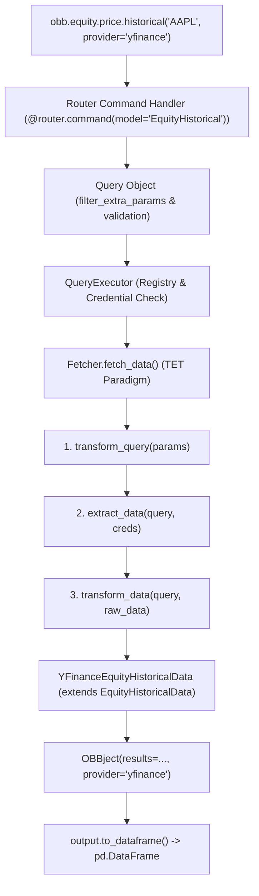

# OpenBB Source Harvest

## Capture metadata

- **Repository**: `https://github.com/OpenBB-finance/OpenBB`
- **Main ref used**: `3e071fcc2cd9f891cac6040ae60296dba76dab46` (develop branch HEAD)
- **Repository Version**: `4.7.3` (`openbb_platform/pyproject.toml`)
- **Captured date**: 2026-08-24
- **Target issue**: [#5 Evaluate OpenBB as financial data infrastructure](https://github.com/carllx/investment-lab/issues/5)
- **Status**: Read-only source harvest for Browser Guidance preparation (Phase 1A Evidence Corrections)

---

## ODP vs Workspace vs data providers

[Source Fact — Pinned]
依据 `README.md` 与 `openbb_platform/` 源码结构，OpenBB 生态在物理与逻辑上被明确划分为三个层次：
1. **Open Data Platform (ODP)**: 位于开源仓库核心（`openbb_platform/`），提供 Python 数据获取基础设施、统一模型定义（`StandardModel`）、路由分发引擎、FastAPI 驱动的 REST API（`openbb-api`，默认本地端口 `127.0.0.1:6900`）以及 MCP 服务扩展（`openbb-mcp-server`）。
2. **OpenBB Workspace**: 官方商业化企业级 Web UI 与分析师工作台（`https://pro.openbb.co`），提供交互式图表与 AI Agent Copilot。ODP 仅作为 Workspace 的本地或远程数据后端（通过 `Connect backend` 连接）。
3. **Third-party Data Providers**: 外部实际数据供应方（如 SEC, FRED, FMP, Intrinio, Tiingo, Yahoo Finance 等）。OpenBB 仅提供开源连接器（Connectors/Fetchers），不托管、不拥有也不重新分发原始数据。

[Commercial / Licensing Boundary]
- **核心边界澄清**：“OpenBB 开源”仅代表其连接器与集成框架开源（AGPLv3）。
- **数据授权独立**：通过 OpenBB 获取的数据受各供应商独立的 Terms of Service、API 配额与商业许可约束。使用 OpenBB 不等于获取免费或无需授权的金融数据。

---

## Architecture: command → provider → standard model → result

[Source Fact — Pinned]
以调用 `obb.equity.price.historical(symbol="AAPL", provider="yfinance")` 为例，完整请求执行链路由以下 7 个步骤构成：



1. **统一命令入口与路由分发** (`openbb_core/app/router.py`, `extensions/equity/.../price_router.py`):
   - 路由函数声明为 `@router.command(model="EquityHistorical")`，接收 `CommandContext`、`ProviderChoices`、`StandardParams` 与 `ExtraParams`。
2. **查询封装与参数过滤** (`openbb_core/app/query.py`):
   - `Query` 对象通过 `filter_extra_params()` 检查传入参数是否属于目标 provider，若包含该 provider 不支持的额外参数，记录 `OpenBBWarning` 并自动剔除。
3. **查询执行器与凭据校验** (`openbb_core/provider/query_executor.py`):
   - `QueryExecutor.execute()` 从 `Registry` 获取指定 provider 及对应的 `Fetcher` 类；
   - 调用 `filter_credentials()` 校验并注入用户配置的 API Key（若该 fetcher 声明 `require_credentials=True` 且缺失对应密钥，抛出 `OpenBBError`）。
4. **Fetcher 的 TET 执行范式** (`openbb_core/provider/abstract/fetcher.py`):
   - **T (Transform query)**: `cls.transform_query(params)` 将通用标准参数转换为供应商特有的查询模型（如 `YFinanceEquityHistoricalQueryParams`）；
   - **E (Extract data)**: `cls.extract_data(query, credentials)` 调用外部 API 或底层客户端（如 `yf_download` 或 HTTP 请求）获取原始数据；
   - **T (Transform data)**: `cls.transform_data(query, data)` 清洗原始数据，映射字段，并实例化为标准数据模型列表。
5. **标准数据模型映射** (`openbb_core/provider/standard_models/equity_historical.py`):
   - `EquityHistoricalData(Data)` 预定义标准字段：`date`, `open`, `high`, `low`, `close`, `volume`, `vwap`。
   - 具体实现类（如 `YFinanceEquityHistoricalData`）继承 `EquityHistoricalData`，并可附带专属字段（如 `split_ratio`, `dividend`）。
6. **结果包装** (`openbb_core/app/model/obbject.py`):
   - 返回统一的 `OBBject[List[YFinanceEquityHistoricalData]]` 容器，封装 `results`, `provider`, `warnings`, `chart`, `extra` 等元数据。
7. **下游消费转换** (`OBBject.to_dataframe()`):
   - 通过 `basemodel_to_df` 将 Pydantic 对象序列化并构造为 `pandas.DataFrame`，自动设置指定索引（默认 `date`）。

---

## Provider abstraction & reliability boundary

[Source Fact — Pinned]
依据 `query_executor.py`、`registry_map.py` 与 `data.py`：
1. **多 Provider 选择与标准化**: 同一 endpoint 可以在运行时显式指定不同 provider（例如 `provider="yfinance"`、`provider="fmp"`、`provider="tiingo"`），返回数据类均继承自相同的 `StandardModel`，标准字段保证名称与基本语义一致。
2. **专有字段与抽象泄露 (Abstraction Leakage)**:
   - 基础模型 `Data` 声明 `model_config = ConfigDict(extra="allow")`，各 Provider 可自由定义专属字段；
   - 转换到 DataFrame 时，专有字段会作为额外列暴露；若上层代码使用了某 Provider 独有的列，更换 Provider 将引发 `KeyError`。
3. **不支持与参数异常处理**:
   - 若请求的 Provider 不支持该 Model，`QueryExecutor` 抛出 `OpenBBError(f"Fetcher not found for model '{model_name}' in provider '{provider.name}'.")`；
   - 若传入不支持的额外参数，`Query` 发出 `OpenBBWarning` 并过滤忽略。
4. **两层可靠性事实 (Reliability Architecture)**:
   - **Core QueryExecutor 层面**：每次请求单选一个 provider，OpenBB **没有**跨供应商自动降级链（cross-provider fallback chain）；主请求异常时不会自动切换备用源。
   - **Provider 内部实现层面**：各个 provider 内部可自主实现可靠性机制。例如 pinned 源码中 FRED provider (`openbb_fred/utils/fred_helpers.py`) 实现了 429 自动重试（auto-retry）、指数退避（exponential backoff）、速率限制（rate limiting）、TTL 内存缓存与并发请求去重（single-flight request deduplication）。
   - **重要边界**：`No cross-provider fallback != No provider-level retry`。

[Architecture Capability vs Automatically Guaranteed Behavior]
- **架构能力 (Architecture Capability)**: 提供了统一的多源契约定义标准与插件化接入机制。
- **自动保证行为 (Automatically Guaranteed Behavior)**: 仅保证单次请求的静态类型分发与参数校验，**不自动保证**跨源容灾切换、全局数据质量对齐或统一的重试策略。

---

## Representative provider inventory

[Source Fact — Pinned]
当前 commit（`3e071fcc2cd9f`）中共内置 **32 个 Provider 扩展包**。以下为 6 大代表性分类及核心清单：

| Provider | 主要数据类别 | 凭据需求 (Credentials) | 开源连接器 | 数据访问费用与条款 (Captured: 2026-08-24) | 主要市场 | investment-lab 潜在用途 |
| :--- | :--- | :--- | :--- | :--- | :--- | :--- |
| **`yfinance`** | Equity, ETF, Index, Crypto, Currency, Futures | Keyless (无) | 是 (`openbb-yfinance`) | [Live Fact] 免费公开爬虫，无官方 SLA，高频调用易受限 | 美股 / 全球 / 部分 A/H 股 | 美股与全球指数基准无成本快速摸底 |
| **`sec`** | Company Filings, 10-K/10-Q, Insider Trading, Form 13F | Keyless (需 User-Agent) | 是 (`openbb-sec`) | [Live Fact] 免费公共数据 (SEC EDGAR)，受 10 req/s 速率限制 | 美股上市公司 | 美股财报披露、基本面核验与机构持仓 |
| **`fred`** | 宏观经济时序 (CPI, GDP, 利率, 货币供应量) | Free API Key (`fred_api_key`) | 是 (`openbb-fred`) | [Live Fact] 免费注册获取 Key，覆盖美联储 80+ 万条权威宏观时序 | 美国 / 全球宏观 | 宏观经济周期、无风险利率与资产定价因子 |
| **`tiingo`** | End-of-day 行情 (含 A 股), 加密货币, 财经新闻 | API Key (`tiingo_token`) | 是 (`openbb-tiingo`) | [Live Fact] Starter: 500 symbols/mo, 50 req/hr, 1000 req/day ($0/mo); Power: $30/mo (tiingo.com/pricing) | 美股 / 中国 A 股 / 加密货币 | 美股及 A 股低成本稳定日线与新闻情感 |
| **`fmp`** (Financial Modeling Prep) | Equity 财务全量、比率、估值、估算、分红 | API Key (`fmp_api_key`) | 是 (`openbb-fmp`) | [Live Fact] 商业数据商，提供有限免费层，深度历史/非美数据需商业订阅 | 美股为主 / 国际市场 | 美股历史基本面多因子与估值指标 |
| **`intrinio`** | Equity, Options, Fundamentals, Real-time feeds | API Key (`intrinio_api_key`) | 是 (`openbb-intrinio`) | [Live Fact] 纯商业数据供应商，按数据集订阅收费，提供机构级 SLA | 美股 / 期权 | 机构级美股回测与高质量清洗后基本面 |
| **`cboe`** | 波动率指数 (VIX, RVX, OVX), 期权与指数数据 | Keyless (无) | 是 (`openbb-cboe`) | [Live Fact] 免费延迟公开数据 | 美国衍生品市场 | 市场恐慌情绪与波动率因子提取 |
| **`bls`** | 劳工与物价统计 (CPI, PPI, 劳动参与率) | Free API Key (`bls_api_key`) | 是 (`openbb-bls`) | [Live Fact] 官方公共统计数据，提供免费 API 访问配额 | 美国宏观 | 通胀与就业周期因子构建 |
| **`famafrench`** | 学术因子 (3-Factor, 5-Factor, 行业动量) | Keyless (无) | 是 (`openbb-famafrench`) | [Live Fact] Dartmouth 学术公开数据集，免费只读 | 美股学术资产定价 | Qlib / 多因子模型基准 Alpha158 与 Fama-French 因子校准 |
| **`econdb`** | 全球 90+ 国家宏观与进出口指标 | Free API Key (`econdb_api_key`) | 是 (`openbb-econdb`) | [Live Fact] 提供免费层与扩展商业配额，海量跨国经济指标 | 全球宏观 | 跨国宏观经济比对 |

---

## Free / API-key / commercial boundary

[Source Fact — Pinned] & [Live First-Party Fact]
OpenBB 将不同层级的 Provider 认证统一抽象于 `Credentials` 模型中（`openbb_core/app/model/credentials.py`），支持通过环境变量（如 `OPENBB_FMP_API_KEY`）或用户配置文件（`~/.openbb_platform/user_settings.json`）管理：
1. **Tier 0: 完全公开无 Key (Keyless / Public)**
   - 代表：`yfinance`, `sec`, `cboe`, `famafrench`, `wsj`, `multpl`。
   - 特点：开箱即用，零直接金钱成本；但依赖公共端点，面临反爬、格式微调与无 SLA 保证风险。
2. **Tier 1: 免费注册获取 API Key (Free Tier)**
   - 代表：`fred`, `bls`, `tiingo` (Starter), `econdb`, `federal_reserve`, `congress_gov`。
   - 特点：官方支持的标准 API，稳定性较高，受每小时/每日配额限制，适合中低频宏观与学术实验。
3. **Tier 2: 商业付费 / 混合订阅 (Commercial / Licensed)**
   - 代表：`intrinio`, `fmp`, `benzinga`, `tiingo` (Power), `tradier`。
   - 特点：高级功能、完整历史跨度与高频调用需绑定商业许可与支付。

---

## Market coverage capability matrix (US / HK / China A-share)

[Interpretation] 基于源码与供应商文档整理的多市场能力矩阵：

| 市场 (Market) | 历史行情 (Price History) | 基本面与财报 (Fundamentals) | 本土特有特色数据 (Local-Specific Data) | 基金产品 (Funds/ETFs) | 衍生品 (Derivatives) | 证据与注意事项 (Evidence / Caveat) |
| :--- | :--- | :--- | :--- | :--- | :--- | :--- |
| **美股 (US Market)** | 完备 (实时、分钟级、长周期日线) | 完备 (SEC 10-K/Q 原文及 FMP/Intrinio 标准三大表) | 完备 (13F 机构持仓、做空比例、内幕交易) | 完备 (美股 ETF / Mutual Funds) | 完备 (CBOE 期权链与波动率指数) | 原生一级支持；多源互为补充 (`sec`, `fred`, `fmp`, `tiingo`, `cboe` 等 20+ 个 provider)。 |
| **港股 (HK Market)** | 部分覆盖 (日线 OHLCV) | 部分覆盖 (国际口径三大表) | **缺失** (无南向资金/港股通、披露易公告、CCASS 席位) | 仅部分港股 ETF | **缺失** (无牛熊证/窝轮链) | 缺乏原生港股专属 provider；依赖 `yfinance` (`0700.HK`)、`fmp` 与 `tiingo` 国际行情。 |
| **中国 A 股 (China A-Share)** | **存在 EOD 覆盖** (`tiingo`, `yfinance`, `fmp`) | **受限/缺失** (仅国际粗粒度映射，缺失 CAS 本土会计科目) | **完全缺失** (无龙虎榜、北向资金/陆股通、融资融券、大宗交易、股东户数、质押比例、申万/中信行业分类) | **完全缺失** (不支持国内开放式公募基金净值与持仓穿透) | **完全缺失** (无中金所/上期所等本土期货期权) | 缺乏 AkShare/Tushare/Wind 等本土特色 provider；Tiingo 明确支持沪深日线，但深度本土量化因子需自建数据管道。 |

[Interpretation]
- **市场覆盖综合判断**：美股生态极度完备（原生支持）；港股为部分国际化覆盖；A 股具备基础日线行情支持（通过 Tiingo/Yahoo），但本土财报科目与特色微观流动性/结构化数据存在显著断层。
- 若要在 `investment-lab` 中开展深入的 A 股多因子与公募基金研究，必须配合国内本土数据源（如 AkShare/Tushare）。

---

## DataFrame and downstream experiment compatibility

[Source Fact — Pinned]
依据 `openbb_core/app/model/obbject.py`：
1. **DataFrame 转换管道**:
   - `OBBject.to_dataframe(index="date", sort_by=None, ascending=True)` (别名 `.to_df()`)：利用 `pandas.DataFrame` 构造表格，将 `date` 列自动设为 DatetimeIndex。
   - `OBBject.to_polars()`: 转换为 `polars.DataFrame`；`OBBject.to_numpy()`: 提取为 `numpy.ndarray`；`OBBject.to_dict()`: 转换为标准字典。
2. **下游接入与摩擦分析**:
   - [Interpretation] pandas DataFrame 输出降低了通用 Python 脚本的集成摩擦，可直接用于本地 Parquet/CSV 存储或 DuckDB 查询。
   - [Interpretation] 但在跨 Provider 切换或导入专业框架（如 Qlib）时，仍存在显著的数据语义与格式摩擦，包括：
     - **Symbol convention**（如 `600519.SS` vs `600519.SH` vs `SHSE:600519` vs `600519`）；
     - **Currency & Timezone**（不同交易所计价币种与时区口径）；
     - **Adjustment semantics**（除权除息算法：前复权 vs 后复权 vs 仅拆股复权）；
     - **Historical coverage**（各供应商历史跨度与停牌日填充差异）；
     - **Provider-specific columns**（专有字段差异）；
   - 数据进入 Qlib 或自定义因子库仍需要明确的 Schema、Instrument 与时间轴转换适配层。

---

## Packaging and minimal-adoption options

[Source Fact — Pinned]
依据 `openbb_platform/pyproject.toml` 与 `extension_loader.py`：
1. **模块化 Entry Points 架构**:
   - 核心路由扩展：`openbb_core_extension`（如 `openbb-equity`, `openbb-economy`）；
   - 供应商扩展：`openbb_provider_extension`（如 `openbb-yfinance`, `openbb-tiingo`, `openbb-fred`）；
   - 结果扩展：`openbb_obbject_extension`（如 `openbb-charting`）。
2. **极简采纳边界 (Minimal Adoption)**:
   - **无需运行服务**: 无需启动 OpenBB Workspace、`openbb-api` 后台服务、MCP server 或 CLI；在纯 Python 脚本中可直接 `from openbb import obb` 调用。
   - **依赖图谱说明**: 尽管无需运行 server 进程，`openbb-core` 自身的 package dependency graph 中仍然包含 `fastapi` 与 `uvicorn`（用于内部 APIRoute 与依赖注入元数据解析）。
   - **按需选择性安装**:
     ```bash
     pip install openbb-core openbb-equity openbb-yfinance openbb-fred openbb-tiingo
     ```

---

## Maintenance-cost analysis

[Interpretation]

| 维护维度 | 方案 A：各实验直接调用独立数据源 (AkShare / Tushare / FRED / Tiingo) | 方案 B：引入 OpenBB 作为统一数据访问层 |
| :--- | :--- | :--- |
| **凭据与配置** | 各库独立管理，散落在不同脚本或 `.env` 中 | 通过 `CredentialsLoader` 统一在 `user_settings.json` 或标准环境变量中管理 |
| **字段与 Schema 标准化** | 需在各实验内部手写清洗胶水代码（如将 AkShare 拼音列名映射为英文） | 官方 Provider 自带 StandardModel 强类型映射，但自研 Provider 仍需自己实现 TET |
| **供应商切换成本** | 换数据源需重写数据获取与清洗逻辑 | 若使用标准字段，仅需修改 `provider="xxx"` 参数；但仍需处理 Symbol 与除权语义差异 |
| **依赖体积与环境负担** | 轻量，按需安装单个三方库（如仅安装 `akshare` 或 `tushare`） | 引入 Pydantic / FastAPI / EntryPoint 框架依赖，安装与打包体积较大 |
| **版本升级与破坏风险** | 数据源改版直接暴露，可快速在本地单点修复或打 patch | 数据源改版受制于 OpenBB Provider 包的更新节奏；调试需穿越 Fetcher/Router 抽象层 |
| **中国市场与公募基金支持** | **原生极佳**（AkShare / Tushare 对 A 股、公募基金、龙虎榜覆盖极其完备） | **基础行情可用但本土特色缺失**，需额外耗费精力自研并维护 `openbb-akshare` 扩展包 |

---

## License and product boundary

[Source Fact — Pinned]
1. **开源许可证**: OpenBB 仓库在 `LICENSE` 及各 package `pyproject.toml` 中显式声明为 **GNU Affero General Public License v3.0 (AGPL-3.0-only)**。
2. **产品层次划分**:
   - `openbb_platform`（ODP 核心库）属于 AGPLv3 开源软件；
   - OpenBB Workspace（云端 SaaS / 分析师前端）是独立产品层，包含专有闭源商业组件。
3. **数据版权独立性**:
   - AGPL 约束的是 OpenBB 代码本身的分发与网络服务修改；
   - 第三方 Provider 的数据版权、商业使用权与 API 配额独立受各供应商协议约束。

---

## Durable architecture lessons

[Interpretation]
无论 `investment-lab` 是否直接引入 OpenBB 依赖，其架构设计提供了以下**高价值工程参考**：
1. **TET (Transform - Extract - Transform) 范式**:
   - 将“参数转换”、“数据提取/网络 I/O”、“格式清洗与标准化”严格拆分为 Fetcher 的三个独立静态方法，极大提升了单测与 mock 的便利性。
2. **StandardModel + Extra 允许机制**:
   - 通过 Pydantic 强类型声明核心字段，同时通过 `ConfigDict(extra="allow")` 兼容异构数据源的特有字段，在“规范性”与“灵活性”之间取得了良好平衡。
3. **统一结果容器 (`OBBject`) 与多格式懒加载导出**:
   - 将原始数据与请求元数据（provider, warnings, extra）打包在统一容器中，并提供 `.to_dataframe()`, `.to_polars()`, `.to_numpy()` 等统一导出方法。
4. **基于 Python Entry Points 的可插拔架构**:
   - 核心框架与具体数据源完全解耦为独立包，使得扩展新数据源无需侵入核心代码库。

---

## What investment-lab should NOT inherit automatically

[Interpretation]
`investment-lab` 在现阶段及未来规划中，明确**不应盲目引入**以下 OpenBB 资产：
1. **OpenBB Workspace 企业级 UI**: 投资实验室以代码化实验、自动化策略回测为主，无需引入重型 Web 看板。
2. **常驻 REST API / FastAPI 后台 (`openbb-api`)**: 本地 Python 研究闭环无需额外维护一个后台 Uvicorn 进程。
3. **MCP Server 与 Excel 插件**: 现阶段量化实验与自动化管线不依赖外部 Excel/MCP 通道。
4. **全量 32+ Provider 全家桶 (`openbb[all]`)**: 绝大部分美国特定机构数据源对核心实验无直接用途，避免引入冗余依赖。
5. **对中国特色数据完备性的预设**: 切忌假设 OpenBB 能直接覆盖 A 股特有微观流动性数据与公募基金穿透。

---

## Open questions

[Open Question for investment-lab]
1. **自研轻量 Adapter vs OpenBB 扩展包**:
   - 为 AkShare/Tushare 开发一套标准的 `openbb-akshare` 插件，与在 `investment-lab/src/data/` 下直接实现轻量级 Protocol/Adapter，哪种维护成本更低？
2. **StandardModel 契约参考**:
   - `investment-lab` 是否应直接吸收 OpenBB 的 `EquityHistoricalData` 字段命名规范作为本地数据库与 Parquet 缓存的标准 Schema？
3. **混合数据架构可行性**:
   - 是否可以仅将 OpenBB 用于美股基本面（SEC/FMP）与全球宏观（FRED），而 A 股与公募基金继续保持国内轻量数据源直连？
4. **许可证合规评估**:
   - 若未来正式采用 OpenBB 作为可分发或网络服务基础设施，需单独进行 AGPL-3.0 许可证与合规性评估。

---

## Primary-source index

[Source Fact — Pinned] 源码关键证据索引：
- **Repository Root**: `README.md`, `LICENSE`, `pyproject.toml`
- **Core Engine**:
  - `openbb_platform/core/openbb_core/app/router.py` (Router 装饰器与命令映射)
  - `openbb_platform/core/openbb_core/app/query.py` (Query 封装与参数过滤)
  - `openbb_platform/core/openbb_core/app/command_runner.py` (命令执行上下文)
  - `openbb_platform/core/openbb_core/app/model/obbject.py` (OBBject 容器与 `to_dataframe()` 实现)
  - `openbb_platform/core/openbb_core/app/model/credentials.py` (凭据加载与 SecretStr 管理)
  - `openbb_platform/core/openbb_core/app/extension_loader.py` (Entry Points 插件加载)
- **Provider Infrastructure & Reliability**:
  - `openbb_platform/core/openbb_core/provider/abstract/provider.py` (Provider 基类)
  - `openbb_platform/core/openbb_core/provider/abstract/fetcher.py` (Fetcher 抽象类与 TET 流程)
  - `openbb_platform/core/openbb_core/provider/abstract/data.py` (Data 基础模型与 Pydantic 配置)
  - `openbb_platform/core/openbb_core/provider/abstract/query_params.py` (QueryParams 基础模型)
  - `openbb_platform/core/openbb_core/provider/query_executor.py` (QueryExecutor 调度逻辑)
  - `openbb_platform/core/openbb_core/provider/registry_map.py` (模型与供应商映射表)
  - `openbb_platform/providers/fred/openbb_fred/utils/fred_helpers.py` (FRED provider 级 429 backoff / retry 与 session 缓存实现)
- **Standard Models & Representative Providers**:
  - `openbb_platform/core/openbb_core/provider/standard_models/equity_historical.py` (历史行情标准模型)
  - `openbb_platform/providers/yfinance/openbb_yfinance/models/equity_historical.py` (yfinance 历史行情 fetcher)
  - `openbb_platform/providers/tiingo/openbb_tiingo/models/equity_historical.py` (tiingo 历史行情 fetcher，覆盖 A-share EOD)
  - `openbb_platform/providers/fmp/openbb_fmp/models/equity_historical.py` (fmp 历史行情 fetcher)
  - `openbb_platform/providers/fred/openbb_fred/models/` (FRED 宏观经济 fetcher)
  - `openbb_platform/providers/sec/openbb_sec/models/` (SEC EDGAR 披露 fetcher)
