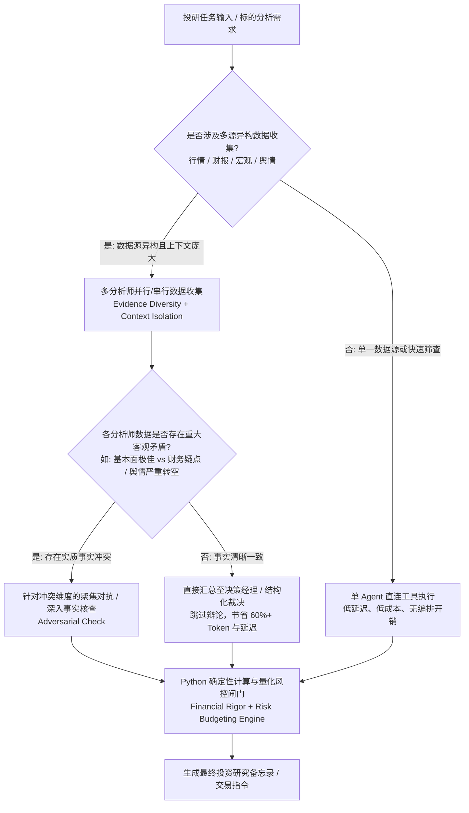

# TradingAgents Source Harvest

## Capture metadata

- **Target repository**: `https://github.com/carllx/investment-lab`
- **Target Issue**: [#7 Evaluate TradingAgents as multi-agent research benchmark](https://github.com/carllx/investment-lab/issues/7)
- **External primary source repository**: `https://github.com/TauricResearch/TradingAgents`
- **Pinned source ref**: `a33fd4c0f134485a43553a2c23a63cb14adbd88f` (Commit Date: 2026-07-28 09:37:37 +0800)
- **Official paper reference**: `TradingAgents: Multi-Agents LLM Financial Trading Framework`, arXiv:2412.20138v7 (`https://arxiv.org/abs/2412.20138`)
- **Working branch**: `research/external-guidance-pilot`
- **Base starting anchor**: `051e21614bb5be1399b0fc620bbce62d487868a8`
- **Captured date**: 2026-08-23
- **Research scope**:
  - 核心配置与入口：`README.md`, `tradingagents/default_config.py`, `tradingagents/main.py`
  - 数据模型与状态：`tradingagents/agents/schemas.py`, `tradingagents/agents/utils/agent_states.py`
  - 图编排与调度：`tradingagents/graph/trading_graph.py`, `tradingagents/graph/setup.py`, `tradingagents/graph/conditional_logic.py`, `tradingagents/graph/propagation.py`, `tradingagents/graph/analyst_execution.py`, `tradingagents/graph/reflection.py`, `tradingagents/graph/signal_processing.py`, `tradingagents/graph/checkpointer.py`
  - 分析师与决策智能体：`tradingagents/agents/analysts/**`, `tradingagents/agents/researchers/**`, `tradingagents/agents/risk_mgmt/**`, `tradingagents/agents/trader/**`, `tradingagents/agents/managers/**`, `tradingagents/agents/utils/**`
  - 数据源流与接入层：`tradingagents/dataflows/**`
  - 官方第一手论文：arXiv:2412.20138v7 全文（实验设置、基线对比、消融分析、评估指标与数据口径）
- **Excluded scope (Authority Boundary)**:
  - 静态营销配图与社交媒体展示（`assets/**`）
  - CLI 终端展示渲染代码（`cli/**`）
  - 仅作为示例的 Docker 部署配置与测试用例（`tests/**`）
  - 任何未经受控对照实验验证的交易收益率宣传语（均标记为 `[Reported Empirical Result]` 或 `[Self-reported / Marketing]`，不作为架构有效性的因果证据）

---

## Architecture overview

### 1. 端到端流程拓扑图

[Source Fact]  
依据 `tradingagents/graph/trading_graph.py:L65-483`、`tradingagents/graph/setup.py:L45-156` 以及 `tradingagents/graph/conditional_logic.py:L6-74`，TradingAgents 的完整运行时流程由 LangGraph 编排的单向状态图驱动：

```mermaid
flowchart TD
    Start([Run Start: propagate]) --> ResolveContext[1. Resolve Instrument Identity & Context<br/>yfinance deterministic cached lookup]
    ResolveContext --> ResolveMemory[2. Resolve Pending Memory Log Entries<br/>Fetch T+5d return vs Benchmark -> Reflector LLM]
    ResolveMemory --> InitState[3. Initialize AgentState<br/>messages, instrument_context, past_context]

    subgraph AnalystLayer [4. Sequential Analyst Execution Layer]
        MarketAnalyst[Market Analyst<br/>tools: get_stock_data, get_indicators, get_verified_market_snapshot] --> ClearMarket[Msg Clear Market<br/>RemoveMessage + Placeholder]
        ClearMarket --> SentimentAnalyst[Sentiment Analyst<br/>pre-fetch: news, StockTwits, Reddit<br/>Structured SentimentReport]
        SentimentAnalyst --> ClearSentiment[Msg Clear Sentiment<br/>RemoveMessage + Placeholder]
        ClearSentiment --> NewsAnalyst[News Analyst<br/>tools: get_news, get_global_news, get_macro_indicators, get_prediction_markets]
        NewsAnalyst --> ClearNews[Msg Clear News<br/>RemoveMessage + Placeholder]
        ClearNews --> FundAnalyst[Fundamentals Analyst<br/>tools: get_fundamentals, balance_sheet, cashflow, income_statement]
        FundAnalyst --> ClearFund[Msg Clear Fundamentals<br/>RemoveMessage + Placeholder]
    end

    InitState --> MarketAnalyst

    subgraph ResearchDebate [5. Bull / Bear Debate & Synthesis]
        ClearFund --> BullResearcher[Bull Researcher<br/>Input: 4 Reports + Debate History<br/>Persona: Advocate Growth & Upside]
        BullResearcher <--> |Alternate until count >= 2 * max_debate_rounds| BearResearcher[Bear Researcher<br/>Input: 4 Reports + Debate History<br/>Persona: Advocate Risk & Downside]
        BullResearcher & BearResearcher --> |Termination Condition Met| ResearchManager[Research Manager<br/>Deep LLM: Synthesizes Debate<br/>Output: Structured ResearchPlan]
    end

    subgraph TraderLayer [6. Transaction Generation]
        ResearchManager --> TraderAgent[Trader Agent<br/>Input: ResearchPlan + Instrument Context<br/>Output: Structured TraderProposal]
    end

    subgraph RiskDebate [7. 3-Way Risk Stance Debate & Portfolio Decision]
        TraderAgent --> AggressiveDebator[Aggressive Analyst<br/>Persona: High-reward, Bold approach]
        AggressiveDebator <--> |3-Way Cycle until count >= 3 * max_risk_rounds| ConservativeDebator[Conservative Analyst<br/>Persona: Capital preservation, Low risk]
        ConservativeDebator <--> NeutralDebator[Neutral Analyst<br/>Persona: Balanced, Moderate approach]
        AggressiveDebator & ConservativeDebator & NeutralDebator --> |Termination Condition Met| PortfolioManager[Portfolio Manager<br/>Deep LLM: Synthesizes Risk Debate + Memory Lessons<br/>Output: Structured PortfolioDecision]
    end

    PortfolioManager --> ProcessSignal[8. Signal Processing & Action Extraction<br/>Extract 5-tier Rating / 3-tier Action]
    ProcessSignal --> LogMemory[9. Log State to Disk & Append Pending Memory Log Entry]
    LogMemory --> End([Run End: Return final_state & signal])
```



### 2. 节点、输入、输出与权威控制矩阵

[Source Fact]  
依据源码中各节点的具体实现，梳理全图各执行节点的核心属性：

| 阶段 / 节点 | 运行 LLM 档位 | 输入信息范围 | 可用工具 / 数据源 | 核心输出内容 | 决策覆写权 (Authority) |
|---|---|---|---|---|---|
| **Market Analyst** (`market_analyst.py:L12-95`) | `quick_think_llm` | `instrument_context`, `trade_date`, `messages` | `get_stock_data`, `get_indicators`, `get_verified_market_snapshot` | `market_report` (Markdown 文本 + 指标表格) | 无（仅提供技术面事实） |
| **Sentiment Analyst** (`sentiment_analyst.py:L51-123`) | `quick_think_llm` | 前置预取结构化文本块（News, StockTwits, Reddit） | 无工具调用（数据直接嵌入 Prompt） | `sentiment_report` (结构化 `SentimentReport` 渲染文本) | 无（仅提供多源情绪评级） |
| **News Analyst** (`news_analyst.py:L13-69`) | `quick_think_llm` | `instrument_context`, `trade_date`, `messages` | `get_news`, `get_global_news`, `get_macro_indicators`, `get_prediction_markets` | `news_report` (宏观/地缘/预测市场报告) | 无（仅提供宏观事实） |
| **Fundamentals Analyst** (`fundamentals_analyst.py:L13-69`) | `quick_think_llm` | `instrument_context`, `trade_date`, `messages` | `get_fundamentals`, `get_balance_sheet`, `get_cashflow`, `get_income_statement` | `fundamentals_report` (财务三表与基本面分析) | 无（仅提供基本面事实） |
| **Bull Researcher** (`bull_researcher.py:L7-61`) | `quick_think_llm` | 4 份分析师报告、辩论历史 `history`、上一轮空方论点 | **无**（禁止工具调用） | `argument` (看多辩论发言) | 无（仅陈述看多论据） |
| **Bear Researcher** (`bear_researcher.py:L7-63`) | `quick_think_llm` | 4 份分析师报告、辩论历史 `history`、上一轮多方论点 | **无**（禁止工具调用） | `argument` (看空辩论发言) | 无（仅陈述看空论据） |
| **Research Manager** (`research_manager.py:L17-70`) | `deep_think_llm` | `instrument_context`、完整多空辩论历史 `history` | **无**（禁止工具调用） | `investment_plan` (结构化 `ResearchPlan`: 5 档评级、理由、执行建议) | **对多空辩论结果有一票裁决权** |
| **Trader Agent** (`trader.py:L21-67`) | `quick_think_llm` | `instrument_context`、Research Manager 的 `investment_plan`（**不接收**原始分析师报告） | **无**（禁止工具调用） | `trader_investment_plan` (结构化 `TraderProposal`: 3 档方向、建仓点位、止损点位) | 将研究计划具体化为交易提案 |
| **Aggressive Analyst** (`aggressive_debator.py:L7-59`) | `quick_think_llm` | 交易员提案、4 份分析师报告、风控辩论历史 | **无**（禁止工具调用） | `argument` (激进立场辩论发言) | 无（仅陈述高收益风险偏好） |
| **Conservative Analyst** (`conservative_debator.py:L7-61`) | `quick_think_llm` | 交易员提案、4 份分析师报告、风控辩论历史 | **无**（禁止工具调用） | `argument` (保守立场辩论发言) | 无（仅陈述保本低波动偏好） |
| **Neutral Analyst** (`neutral_debator.py:L7-59`) | `quick_think_llm` | 交易员提案、4 份分析师报告、风控辩论历史 | **无**（禁止工具调用） | `argument` (中性稳健辩论发言) | 无（仅陈述平衡折中观点） |
| **Portfolio Manager** (`portfolio_manager.py:L25-95`) | `deep_think_llm` | 投资计划、交易员提案、历史反思教训 `past_context`、完整风控辩论历史 | **无**（禁止工具调用） | `final_trade_decision` (结构化 `PortfolioDecision`: 最终 5 档评级、执行摘要、论点、目标价) | **全系统最高决策权威**，可完全重塑或否决前序提案 |

---

## Analyst layer

### 1. 分析师信息输入与工具差异

[Source Fact]  
依据 `tradingagents/agents/analysts/**` 与 `tradingagents/dataflows/interface.py:L35-144`：
1. **Market Analyst (`market_analyst.py`)**：
   - 绑定工具：`get_stock_data`（获取 OHLCV 历史时序）、`get_indicators`（基于 `stockstats` 计算 50/200 SMA、10 EMA、MACD、RSI、Bollinger Bands、ATR、VWMA 等最多 8 个互补指标）、`get_verified_market_snapshot`（确定性基准价格快照）。
   - 认知任务：识别中短期趋势、动量拐点、波动区间与支撑阻力位。
2. **Sentiment Analyst (`sentiment_analyst.py`)**：
   - 数据接入模式：不采用 Tool-calling，而是在节点执行前同步预取三大源并注入 Prompt：
     - Yahoo Finance 机构新闻标题（过去 7 天）；
     - StockTwits 散户讨论（按 cashtag 检索，包含带标注的 Bullish/Bearish 标签，最多 30 条）；
     - Reddit 社区发帖（覆盖 `r/wallstreetbets`, `r/stocks`, `r/investing`）。
   - 结构化约束：输出严格遵从 `SentimentReport` Pydantic 模型（6 档情感区间 `overall_band`、0–10 分值 `overall_score`、3 档置信度 `confidence` 与分源叙事 `narrative`）。
3. **News Analyst (`news_analyst.py`)**：
   - 绑定工具：`get_news`（个股相关新闻）、`get_global_news`（针对美联储利率、GDP、地缘政治、央行政策、能源等 5 大预设查询的主题新闻）、`get_macro_indicators`（直连 FRED 获取 CPI、Core PCE、Unemployment、Fed Funds Rate、10Y Treasury、Yield Curve 时序）、`get_prediction_markets`（直连 Polymarket 获取降息、衰退等预测事件的市场隐含概率）。
   - 认知任务：宏观环境定调、地缘政治风险排查与前瞻事件概率校准。
4. **Fundamentals Analyst (`fundamentals_analyst.py`)**：
   - 绑定工具：`get_fundamentals`（公司概况与关键财务比率）、`get_balance_sheet`（资产负债表）、`get_cashflow`（现金流量表）、`get_income_statement`（利润表）。
   - 认知任务：公司盈利能力、财务健康度、资产负债结构与长期价值评估。

### 2. 证据独立性与隔离机制

[Source Fact]  
依据 `tradingagents/agents/utils/agent_utils.py:L190-216`：
- 每个分析师节点执行完毕后，图流转都会经过一个显式的 `create_msg_delete()` 清理节点。
- `delete_messages()` 会对当前上下文中的所有消息执行 `RemoveMessage` 操作，并仅注入一个包含标的上下文与日期的标准占位消息。
- **机制效果**：分析师之间的 LLM 对话上下文是**完全物理隔离**的。Market Analyst 不会看到 Fundamentals Analyst 的思考轨迹或工具调用报错，避免了早期模型常见的 Prompt 污染与上下文爆炸。

[Interpretation]  
- **分析师层的本质**：分析师层真正实现了 **[Evidence Diversity]**（证据多样性）与 **[Context Isolation]**（上下文隔离）。4 个分析师分别对接不同的外部 API、数据结构与分析维度，其产生的分歧来自真实世界数据源的客观差异（如基本面优秀但技术面超买、机构新闻偏多但社交媒体情绪转空）。这是 TradingAgents 架构中最具实质价值的部分。

---

## Bull / Bear debate

### 1. 辩论机制与输入事实核查

[Source Fact]  
依据 `tradingagents/agents/researchers/bull_researcher.py:L27-46` 与 `bear_researcher.py:L27-48`：
- **输入完全对称**：多方（Bull Analyst）与空方（Bear Analyst）接收完全相同的 4 份分析师报告文本字符串（`market_report`, `sentiment_report`, `news_report`, `fundamentals_report`）以及当前累计的辩论历史 `history`。
- **工具权限为零**：两者均没有绑定任何数据获取工具或搜索工具，无法发起任何外部事实核查。
- **Prompt 强制对立**：
  - 多方提示词：“You are a Bull Analyst advocating for investing... Build a strong, evidence-based case emphasizing growth potential...”
  - 空方提示词：“You are a Bear Analyst making the case against investing... Present a well-reasoned argument emphasizing risks, challenges...”

### 2. 辩论轮次与状态转移

[Source Fact]  
依据 `tradingagents/graph/conditional_logic.py:L52-62` 与 `tradingagents/default_config.py:L110`：
- 默认配置 `max_debate_rounds = 1`。
- 状态转移逻辑：多方先发言，空方随后基于多方论点反驳。当 `count >= 2 * max_debate_rounds`（默认 2 次发言，即多空各 1 轮）时，条件路由立即将控制权转移给 `Research Manager`。
- 状态字典 `InvestDebateState` 在每次流转时通过简单的字符串拼接累积历史：`"history": history + "\n" + argument`。

### 3. Research Manager 的仲裁机制

[Source Fact]  
依据 `tradingagents/agents/managers/research_manager.py:L26-68` 与 `tradingagents/agents/schemas.py:L73-104`：
- Research Manager 仅阅读累计的 `history`，由 `deep_think_llm`（默认 `gpt-5.5`）生成结构化 `ResearchPlan`：
  - `recommendation`: 5 档投资建议之一（Buy / Overweight / Hold / Underweight / Sell）；
  - `rationale`: 对辩论双方关键论点的对话式总结；
  - `strategic_actions`: 给交易员的具体执行指令与仓位建议。

[Interpretation]  
- **批判性归类**：该层属于典型的 **[Persona Diversity]**（角色扮演多样性），而非真正的对抗性审查（Adversarial Review）。
  - 多空双方并没有各自专属的信息渠道，也没有独立的查证能力；
  - 其辩论过程本质上是**同一个 LLM（或同类型模型）在不同系统角色提示词下，对同一份静态报告文本进行选择性提取与修辞性极化**；
  - 所谓的“辩论”无法产生任何超出 4 份分析师报告之外的新信息增量，且极易导致上下文冗余复制与推理 Token 翻倍。

---

## Trader decision layer

### 1. 交易员输入与信息折损

[Source Fact]  
依据 `tradingagents/agents/trader/trader.py:L24-66`：
- Trader Agent 的输入构建极为特殊：
  ```python
  f"Proposed Investment Plan: {investment_plan}\n\nLeverage these insights to make an informed and strategic decision."
  ```
- **关键事实**：Trader **不接收**原始的 4 份分析师报告，也**不接收**多空辩论的完整对话历史！它仅仅接收 Research Manager 提炼后的 `investment_plan` 文本以及标的身份。

### 2. 交易动作输出规范

[Source Fact]  
依据 `tradingagents/agents/schemas.py:L121-180`：
- Trader 必须输出遵从 `TraderProposal` 的结构化提案：
  - `action`: 3 档交易方向（`Buy` / `Hold` / `Sell`）；
  - `reasoning`: 2–4 句理由阐述；
  - `entry_price` (可选): 目标入场价；
  - `stop_loss` (可选): 止损价格；
  - `position_sizing` (可选): 仓位指引（如 `"5% of portfolio"`）。

[Interpretation]  
- **架构断层与冗余**：
  - Research Manager 已经输出了 5 档评级（含 Overweight / Underweight）与战略行动建议；
  - Trader 的主要作用仅仅是将 5 档评级压缩为 3 档交易动作（Buy/Hold/Sell），并尝试拟定入场点和止损点；
  - 这种设计属于 **[Implementation-Specific]** 的拟人化流程设计，实际上在 Research Manager 与后续的风控团队之间制造了一个非必要的信息瓶颈。

---

## Risk debate

### 1. 风控辩论角色构成与输入

[Source Fact]  
依据 `tradingagents/agents/risk_mgmt/**`：
- 系统内置 3 个风控辩论智能体：
  1. `Aggressive Analyst` (`aggressive_debator.py`): 角色偏好强调高回报、高风险、进攻性增长与竞争优势；
  2. `Conservative Analyst` (`conservative_debator.py`): 角色偏好强调本金安全、最小化波动、防御性风控与潜在下行风险；
  3. `Neutral Analyst` (`neutral_debator.py`): 角色偏好强调风险收益平衡、稳健适度与分散化。
- **输入数据**：3 个风控角色均接收相同的 4 份原始分析师报告、Trader 的交易提案 `trader_investment_plan` 以及风控辩论历史。
- **工具权限为零**：没有接入任何量化风控工具（无 VaR 计算、无压力测试引擎、无波动率模型、无组合协方差矩阵计算工具）。

### 2. 辩论流转与 Portfolio Manager 终审

[Source Fact]  
依据 `tradingagents/graph/conditional_logic.py:L63-74`、`tradingagents/graph/setup.py:L145-153` 与 `tradingagents/agents/managers/portfolio_manager.py:L25-95`：
- 默认配置 `max_risk_discuss_rounds = 1`。
- 转移规则为 3 节点固定循环：`Aggressive -> Conservative -> Neutral`。当发言次数 `count >= 3 * max_risk_discuss_rounds`（默认 3 次发言，各角色 1 轮）时，流转至 `Portfolio Manager`。
- **Portfolio Manager**（`deep_think_llm`）综合多方信息，输出最终的 `PortfolioDecision`（包含 5 档最终评级 `rating`、执行摘要 `executive_summary`、投资论点 `investment_thesis`、目标价 `price_target` 与持有周期 `time_horizon`）。

[Interpretation]  
- **批判性归类**：风控层同样属于 **[Persona / Prompt-Specific]** 的拟人化修辞机制。
  - 3 个风控角色之所以立场不同，完全是因为 Prompt 强加了“激进/保守/中性”的性格设定，而非其各自掌握了不同的风险暴露数据；
  - 整个过程没有任何硬性量化风控约束（如“波动率超过 X% 强制降仓”或“最大回撤触及 Y% 强制平仓”）；
  - Portfolio Manager 拥有完全的自由裁量权，其对风险的考量完全依赖大语言模型的常识推理，而非金融工程意义上的风险管理。

---

## Graph / shared state / routing

### 1. 状态结构与信息共享边界

[Source Fact]  
依据 `tradingagents/agents/utils/agent_states.py:L47-77`：
- 全局共享状态 `AgentState` 继承自 LangGraph 的 `MessagesState`，包含两类字段：
  1. **专用报告字符串字段**：`market_report`, `sentiment_report`, `news_report`, `fundamentals_report`, `investment_plan`, `trader_investment_plan`, `final_trade_decision`, `past_context`, `instrument_context`；
  2. **子对话状态字典**：`investment_debate_state`（类型 `InvestDebateState`）与 `risk_debate_state`（类型 `RiskDebateState`）。
- **消息累积控制**：分析师通过 `RemoveMessage` 机制重置 `messages` 列表，防止工具调用轨迹与中间推理污染全局对话；辩论历史则单独以字符串形式追加至子状态字典。

### 2. 检查点恢复与断点续跑 (Checkpoint Resume)

[Source Fact]  
依据 `tradingagents/graph/checkpointer.py:L1-120` 与 `tradingagents/graph/trading_graph.py:L348-403`：
- 框架基于 SQLite（`SqliteSaver`）实现了按标的隔离的本地检查点机制（存储于 `~/.tradingagents/cache/checkpoints/<TICKER>.db`）。
- 线程 ID 由运行签名派生：
  `thread_id = ticker|date|analysts=...|debate=N|risk=M|asset=stock`
- 当配置 `checkpoint_enabled=True` 时，崩溃或中断的执行可在下一次运行时精确从最后一个成功节点恢复，执行完毕后自动清理临时检查点。

[Interpretation]  
- **图架构模式归类**：
  - **[Durable Orchestration Pattern]**：按业务阶段切分分析/辩论/决策子状态、在独立节点间清理历史消息保持上下文纯净、基于运行签名的状态持久化与断点续跑。
  - **[LangGraph-Specific Implementation]**：`MessagesState` 继承、`RemoveMessage` 补丁式清理、LangGraph 条件路由映射字典 `DEBATE_PATH_MAP`。

---

## Reflection / memory

### 1. 记忆写入与延迟反思机制 (Phase A vs Phase B)

[Source Fact]  
依据 `tradingagents/agents/utils/memory.py:L1-200`、`tradingagents/graph/reflection.py:L1-58` 与 `tradingagents/graph/trading_graph.py:L251-335`：
- 系统采用两阶段（Phase A / Phase B）追加式 Markdown 记忆文件（`~/.tradingagents/memory/trading_memory.md`）：
  - **Phase A (写入阶段)**：每次 `propagate()` 结束时，将当前决策作为 `pending` 状态追加至文件尾部：
    ```markdown
    [2026-01-15 | NVDA | Buy | pending]
    DECISION:
    ...
    <!-- ENTRY_END -->
    ```
  - **Phase B (延迟结算与反思阶段)**：在未来某日再次运行相同标的（`company_name`）时，`_resolve_pending_entries()` 会首先触发：
    1. 调用 `yfinance` 获取 $t$ 日后 $5$ 个交易日的实际收益率（Raw Return）以及相对基准指数（美股默认 SPY，非美股根据后缀映射）的超额收益率（Alpha Return）；
    2. 若价格数据就绪，调用 `Reflector.reflect_on_final_decision()`，使用 `quick_thinking_llm` 生成 2–4 句的反思总结（回答：方向是否正确？论点哪部分成立/失效？下一次的经验教训？）；
    3. 通过原子替换将 `pending` 标签更新为实际收益数据并追加 `REFLECTION:` 块。

### 2. 记忆注入与作用范围

[Source Fact]  
依据 `tradingagents/agents/utils/memory.py:L70-96` 与 `tradingagents/agents/managers/portfolio_manager.py:L36-63`：
- 在运行初始阶段，`get_past_context(ticker, n_same=5, n_cross=3)` 读取最近 5 条同标的历史决策记录与最近 3 条跨标的反思教训；
- **关键作用范围**：该历史反思文本 `past_context` **仅注入给 Portfolio Manager**，前序的分析师、多空辩论员、交易员与风控辩论员均无法看到该记忆。

[Interpretation]  
- **反思机制的真实属性**：
  - 这**不是**模型权重层面的强化学习或微调，而是一种简单的**少样本 Prompt 提示检索（In-Context Few-Shot Retrieval）**；
  - **后视偏差与过拟合风险 (Hindsight Rationalization)**：LLM 的反思是在已知 5 日价格涨跌后进行的后验解释。如果回测流程未严格按照时间步递推，或者历史数据存在时滞偏差，极易将未来的价格结果转化为虚假的因果归因注入给 Portfolio Manager。

---

## Evidence diversity vs persona diversity

[Interpretation]  
通过对源码全面解剖，可清晰划定两类多样性的边界：

| 维度 | Evidence Diversity (证据多样性) | Persona Diversity (角色扮演多样性) |
|---|---|---|
| **源码体现层** | **Analyst Team** (Market, Sentiment, News, Fundamentals) | **Researcher Team** (Bull/Bear) 与 **Risk Team** (Aggressive/Conservative/Neutral) |
| **信息独立性** | **真实独立**：每个分析师读取完全不同的外部 API、数据结构与领域事实。 | **完全同源**：所有角色读取完全相同的上游报告文本，无任何专属工具或数据源。 |
| **冲突产生机制** | **数据驱动的客观矛盾**（如：财报高增长 vs 技术面超买；机构新闻向好 vs 散户情绪悲观）。 | **Prompt 强加的主观立场**（“你必须看多” vs “你必须看空”；“你必须激进” vs “你必须保守”）。 |
| **认知增量价值** | **高价值**：扩展了系统的信息覆盖广度与多模态维度。 | **低价值 / 易产生幻觉**：纯粹通过语言修辞重新包装已知事实，增加 Token 消耗与推理延迟。 |
| **投资研究启示** | 应当在投研系统中长期保留和深化。 | 应当极度审慎，避免陷入无意义的拟人化角色表演（Persona Theater）。 |

---

## Multi-agent incremental-value analysis

[Interpretation]  
结合源码事实对多智能体架构的 4 种潜在价值进行逐项判定：

```
+---------------------------------------------------------------------------------------------------------------------------------------------------+
| Multi-Agent Potential Value   | TradingAgents Codebase Mechanism                  | Empirical Evidence in Paper | Definitive Verdict              |
+---------------------------------------------------------------------------------------------------------------------------------------------------+
| A. Evidence Coverage          | 4 specialized analysts binding diverse APIs       | None (No single-agent/data  | Architecturally enabled;        |
|                               | (OHLCV, StockTwits, Reddit, FRED, Statements)     | ablation comparison)        | highly plausible value.         |
|                               |                                                   |                             |                                 |
| B. Cognitive Decomposition    | Modular division: Data Collection -> Synthesis -> | None (No end-to-end vs      | Architecturally sound;          |
|                               | Proposal -> Risk Review -> Final Decision         | decomposed baseline)        | improves maintainability.       |
|                               |                                                   |                             |                                 |
| C. Adversarial Challenge      | Bull/Bear & 3-way Risk debates with forced        | None (Debate layers were    | Unproven Mechanism;             |
|                               | opposing system prompts                           | never ablated in paper)     | prone to persona theater.       |
|                               |                                                   |                             |                                 |
| D. Context Isolation          | `create_msg_delete` wipes LangGraph messages      | None (No token/context      | Clear engineering value;        |
|                               | between analysts; sub-states store discrete text  | window efficiency study)    | prevents message pollution.     |
+---------------------------------------------------------------------------------------------------------------------------------------------------+
```

1. **A. Evidence Coverage (证据覆盖增量)**：
   - *源码机制*：通过分析师分工，分别对接专业领域的数据接口（如 FRED 宏观指标、Polymarket 预测市场、StockTwits 散户标签），有效扩大了信息获取广度。
   - *实证状态*：官方论文未提供对比“只喂单一数据源 vs 喂完整多源数据”的消融实验。
2. **B. Cognitive Decomposition (认知分解增量)**：
   - *源码机制*：将复杂的端到端投资决策分解为“数据收集”、“辩论汇总”、“交易提案”、“风控审查”与“最终裁决”等子任务，降低了单个 LLM Prompt 的认知负荷。
   - *实证状态*：官方论文未设立“单个超长 Prompt 直接给出决策”的对照组。
3. **C. Adversarial Challenge (对抗性挑战增量)**：
   - *源码机制*：设置了多空辩论与三方风控辩论，但在缺乏独立工具核查的情况下，本质为同质模型的角色扮演。
   - *实证状态*：**零实验证据**。没有数据证明加入多空辩论后收益率或夏普比率有统计学显著提升。
4. **D. Context Isolation (上下文隔离增量)**：
   - *源码机制*：显式使用 `RemoveMessage` 清除分析师之间的工具交互痕迹，将长篇分析沉淀为确定性的报告字符串，显著减少了上下文长度和注意力稀释。
   - *实证状态*：具备明确的软件工程与 Token 效率价值，但论文未做量化注意力分布研究。

---

## Empirical evidence from first-party paper

[Reported Empirical Result]  
基于对官方论文 `arXiv:2412.20138v7` 的全文深度审查，系统记录其实证数据与实验设计：

### 1. 实验设置与范围
- **回测区间**：**2024 年 1 月 1 日 至 2024 年 3 月 29 日**（共 3 个月，约 61 个交易日，见 Section 5.1 & 5.2）。
- **股票范围**：
  - 正文声称：覆盖 Apple、Nvidia、Microsoft、Meta、Google 等科技股（Section 5.1:L593）；
  - 实际报告：**仅报告了 3 只美股巨头** —— **AAPL**, **GOOGL**, **AMZN**（Table 1:L645-795）；Nvidia、Microsoft、Meta 在全篇实验表格中完全缺失。
- **基线模型 (Baselines)**：
  - 市场基线：Buy & Hold (B&H)；
  - 传统技术指标策略：MACD, KDJ & RSI, ZMR (Zero Mean Reversion), SMA。
  - **缺失的关键基线**：没有任何现代机器学习基线（如 LightGBM / XGBoost），没有任何强化学习交易基线（如 FinRL / PPO），**完全没有单智能体 LLM（Single-Agent LLM）基线**。
- **模型骨干**：
  - 深度推理模型：OpenAI `o1-preview`（用于分析师、辩论员与交易员）；
  - 快速模型：`gpt-4o` 与 `gpt-4o-mini`（用于数据检索与辅助摘要）。

### 2. 报告收益指标与口径异常

[Source Fact]  
论文 Table 1 报告的核心指标如下：

| 标的股票 | 策略 / 模型 | 报告累计收益 (CR%) | 报告年化收益 (AR%) | 报告夏普比率 (SR) | 报告最大回撤 (MDD%) |
|---|---|---|---|---|
| **AAPL** | Buy & Hold | -5.23% | -5.09% | -1.29 | 11.90% |
| | 最优传统基线 (KDJ&RSI) | +2.05% | +2.07% | +1.64 | **0.86%** |
| | **TradingAgents (Ours)** | **+26.62%** | **+30.50%** | **8.21** | 0.91% |
| **GOOGL** | Buy & Hold | +7.78% | +8.09% | +1.35 | 13.04% |
| | 最优传统基线 (SMA) | +6.23% | +6.43% | +2.31 | **1.22%** |
| | **TradingAgents (Ours)** | **+24.36%** | **+27.58%** | **6.39** | 1.69% |
| **AMZN** | Buy & Hold | +17.10% | +17.60% | +3.53 | 3.80% |
| | 最优传统基线 (SMA) | +11.01% | +11.60% | +2.22 | **0.82%** |
| | **TradingAgents (Ours)** | **+23.21%** | **+24.90%** | **5.60** | 2.11% |

### 3. 统计有效性与实验缺陷批判

[Interpretation]  
论文在实证层面存在以下重大缺陷，**不足以证明多智能体架构的因果有效性**：
1. **消融实验缺失 (Zero Ablations)**：论文中未进行任何模块消融测试，无法证明多空辩论、风控辩论或多角色划分对最终收益有独立正贡献。
2. **缺乏 Single-Agent 对照**：未测试“将全部多模态数据输入给单个 o1-preview 模型直接输出买卖信号”，无法排除超额收益纯粹来自 o1-preview 强大的通用推理能力。
3. **年化收益率数学计算错误**：论文定义年化公式为 $AR = ((V_{end} / V_{start})^{1/N} - 1) \times 100\%$。在 3 个月回测中（$N=0.25$），AAPL 累计收益 $26.62\%$ 对应的真实复利年化应为 $(1+0.2662)^4 - 1 = 157.4\%$，但 Table 1 却报告为 $30.50\%$，反映出指标计算的不严谨。
4. **异常夏普比率与样本偏差**：报告的夏普比率高达 8.21、6.39、5.60。作者在 Footnote 1 中承认这是因为“3 个月内标的未发生显著回调”，属于严重的时间窗口选择偏差与过拟合。
5. **零摩擦假设**：未计入任何交易手续费、买卖滑点与做空借券成本。高频的多空双向调仓在零摩擦环境下严重放大了策略收益。
6. **样本量极小**：仅 3 只股票、61 个交易日、单次回测轨迹、无误差棒、无随机种子测试、无统计显著性检验（p-value）。

---

## Cost / complexity analysis

[Source Fact]  
依据 `tradingagents/default_config.py` 与各节点执行逻辑，对一次标准运行的结构性开销进行统计：

| 流程阶段 | 涉及节点数 | 单次运行 LLM 调用次数 | 外部 API / 工具调用次数 | Token 消耗特征 | 复杂度性质 |
|---|---|---|---|---|---|
| **分析师层** | 4 个节点 | 4–8 次（每个工具调用循环 1–2 次） | 10–20+ 次 (OHLCV, 指标, 新闻, FRED, 财报) | 包含大量原始行情、新闻与财报文本 | 结构性必然（数据收集必须） |
| **多空辩论层** | 3 个节点 | $2 \times \text{max\_rounds} + 1$ 次 (默认 3 次) | 0 次 | 每次调用均完整复制 4 份长篇研报文本 | **高昂且可裁剪**（重复上下文累积） |
| **交易员层** | 1 个节点 | 1 次 | 0 次 | 仅包含 Research Plan 文本 | 轻量 |
| **风控辩论层** | 4 个节点 | $3 \times \text{max\_risk\_rounds} + 1$ 次 (默认 4 次) | 0 次 | 每次调用均完整复制 4 份长篇研报 + 交易提案 | **高昂且可裁剪**（重复上下文累积） |
| **反思记忆层** | 1 个节点 | 1 次 (Phase B 结算时) | 1 次 (yfinance T+5d 收益核查) | 极短输入与输出 (2–4 句) | 极轻量 |
| **默认单次运行总计** | **13 个 Agent** | **约 13 – 18 次 LLM 调用** | **15 – 25 次数据调用** | **单次分析消耗数万至十万级 Token** | 依赖高配模型时单次分析成本显著 |

[Interpretation]  
- **延迟与成本瓶颈**：在默认单轮辩论下，单只股票单日分析需要触发 13+ 次 LLM 调用（其中 Research Manager 与 Portfolio Manager 往往需要高成本的 Deep-Thinking 强推理模型），耗时数分钟。如果将辩论轮次提升至 2–3 轮，LLM 调用次数将突破 30 次，成本和延迟将呈线性爆炸。

---

## Durable patterns vs TradingAgents-specific implementation

[Interpretation]  
提炼可跨框架复用的长效多智能体架构模式，并剥离 TradingAgents 的具体实现：

| 机制 / 模块 | 源码权威出处 | 是否长效模式? | 实证证据支持? | 是否仅角色扮演? | 是否特定实现绑定? | investment-lab 潜在用途 | 实施告诫与边界 |
|---|---|---|---|---|---|---|---|
| **多源异构证据独立收集** | `agents/analysts/**`, `dataflows/**` | **YES** | 逻辑自洽（但无论文消融） | 否 (真实数据差异) | 否 (通用数据接入模式) | 拆分技术面、基本面、宏观与另类情绪收集 | 必须设立统一的数据清洗与容错准出规范 |
| **分析师间上下文物理隔离** | `agent_utils.py:create_msg_delete` | **YES** | 具备工程验证 | 否 (上下文管理) | 绑定 LangGraph `RemoveMessage` | 控制长推理链上下文污染与 Token 爆炸 | 可通过干净的无状态函数或独立 Subagent 实现 |
| **结构化 Pydantic 输出契约** | `agents/schemas.py` | **YES** | 具备工程验证 | 否 (数据契约) | 否 (行业通用标准) | 规范各投研阶段的输出协议，供下游直接解析 | 避免在决策链路中层层进行自然语言文本序列化 |
| **按签名隔离的断点续跑** | `graph/checkpointer.py` | **YES** | 具备工程验证 | 否 (工程容灾) | 绑定 SQLite / LangGraph Checkpoint | 长流程投研任务的崩溃重试与状态恢复 | 需确保检查点签名覆盖所有图结构与参数变化 |
| **两阶段延迟反思日志** | `utils/memory.py`, `graph/reflection.py` | **YES** | 具备工程验证 | 否 (Prompt 检索) | 绑定 Markdown 格式与 yfinance | 记录历史决策胜率与特定标的的教训 | 严防回测中的后视偏差与未来信息泄漏 |
| **强制多空语言辩论** | `agents/researchers/**` | **NO** | **完全无证据** | **是 (Persona 包装)** | 否 (纯 Prompt 编排) | 仅作为定性压力测试的一个可选视角 | 严禁作为核心投研流水线的必经阻塞节点 |
| **三方无工具风控辩论** | `agents/risk_mgmt/**` | **NO** | **完全无证据** | **是 (Persona 包装)** | 否 (纯 Prompt 编排) | 淘汰（无意义的修辞消耗） | 必须替换为 Python 确定性量化风控工具闸门 |
| **交易员中间层转发** | `agents/trader/trader.py` | **NO** | 无证据 | 否 (冗余转译) | 属于其拟人化设计 | 淘汰（直接由研究或组合经理输出） | 减少非必要的信息中继与精度折损 |

---

## What investment-lab should NOT inherit automatically

[Interpretation]  
明确列出 `investment-lab` 在设计自身多智能体投研体系时**坚决不能盲目复制**的反模式清单：

1. **Persona Theater (角色扮演表演)**：严禁在没有独立数据输入和量化工具支持的情况下，仅仅通过给 LLM 注入“激进”、“保守”、“看多”、“看空”等系统提示词来制造虚假的分歧。
2. **强制二元多空对立 (Forced Binary Polarization)**：无需在每个标的上都强行运行多空对抗；对于事实明确、数据高度一致的标的，强制多空辩论只会增加幻觉和上下文开销。
3. **无量化工具的风控层 (Tool-less Risk Management)**：严禁依赖 LLM 自然语言“讨论”来进行风控；风控必须由确定性的 Python 规则、硬性止损阈值、头寸缩放公式（如波动率倒数/凯利准则）和组合敞口约束执行。
4. **多层冗余的人事架构 (Redundant Bureaucracy)**：避免盲目复制“分析师 $\to$ 多空辩论 $\to$ 研究经理 $\to$ 交易员 $\to$ 风险辩论 $\to$ 组合经理”这一长达 6 层的中继链条，应大幅精简决策链路。
5. **低效的上下文全量复制 (Context Repetition Bloat)**：不要在多轮辩论中将数千字的上游分析师报告反复拼接并发送给同一个模型的不同角色。
6. **未经验证的超额收益宣传 (Unverified Marketing Metrics)**：不要轻信官方 README 和论文中在 3 个月窗口、零交易摩擦、3 只股票上跑出的高夏普比率（如 8.21），不能将其作为架构优越性的依据。
7. **将反思等同于模型学习 (Over-interpreting Reflection as Learning)**：反思机制只是外部追加的 Markdown 提示词检索，不能过度解释为大模型的自主认知进化。

---

## Single Agent vs Multi Agent routing framework

[Interpretation / Candidate Guidance]  
基于 TradingAgents 的源码事实与局限性，为 `investment-lab` 提炼可迁移的智能体调度路由决策框架：



### 路由判断准则：
1. **单 Agent 足够（无需多 Agent）**：
   - 任务属于指标查询、单一财报数据提取、公式验算、标准化多因子打分或低不确定性标的快筛。
   - 单 Agent 直连工具（Tool-calling）以最低的延迟与成本即可完成，多 Agent 编排只会带来额外的通信开销与格式错误。
2. **需要多分析师分解（Evidence Diversity）**：
   - 任务需要跨越 SEC 披露、高频行情技术面、FRED 宏观经济时序与社交媒体另类数据等多模态领域。
   - 此时采用独立的分析师节点，配合上下文物理清理（Context Isolation），能显著防止长上下文导致的注意力丢失。
3. **何时值得引入对抗审查（Adversarial Review）**：
   - **仅在发现多源数据存在重大事实冲突或估值处于极端分歧点时触发**。
   - 对抗审查必须赋予反方**事实检索与证伪工具**（如检索做空报告、查验历史财务造假嫌疑），严禁退化为无工具的纯文本修辞辩论。
4. **风控环节必须使用确定性代码工具**：
   - 放弃“三个风控角色讨论”，直接通过 Python 编写的确定性风险闸门（检查持仓上限、行业集中度、波动率预算、流动性约束与止损规则）进行硬性拦截与头寸缩放。

---

## Relationship to ai-berkshire Guidance

[Interpretation]  
对比 `ai-berkshire` 与 `TradingAgents` 的一手实现，深化对多智能体投研架构的认知：

1. **对“独立性增量”假说的深化检验**：
   - `ai-berkshire` 给出的核心洞见是：“只有当独立性真正增加信息时，多 Agent 才有价值”；其架构通过双源交叉核验（`cross_validate`）与确定性 Python 计算工具（`financial_rigor.py`, `terminal_value.py`）严格约束了事实与数值的独立性。
   - `TradingAgents` 提供了反向的生动案例：在分析师层（Analyst Layer），由于分别对接了真实世界的不同 API（技术面 vs 基本面 vs 宏观 vs 舆情），其多智能体分工展现了清晰的 **[Evidence Diversity]** 价值；然而在辩论层与风控层，由于剥离了独立工具与数据源，多智能体迅速退化为无信息增量的 **[Persona Theater]**。
2. **决策链路与质量控制模式对比**：
   - `TradingAgents` 试图通过“模拟真实交易公司的人事汇报层级（分析师 $\to$ 研究员 $\to$ 经理 $\to$ 交易员 $\to$ 风控员 $\to$ 基金经理）”来实现质量控制，但由于各层级均依赖同一 LLM 的自然语言博弈，缺乏客观真理仲裁标准，容易导致误差逐层累积与严重的信息瓶颈；
   - 真正可靠的 AI 投研系统应当采用“**异构数据多智能体收集 + 结构化数据契约 + 确定性 Python 算子与审计闸门 + 最终裁决经理**”的精简混合架构。

---

## Open questions

[Open Question for investment-lab]
1. **多分析师证据聚合的最优 Token 架构**：分析师生成的报告是应该保持 Markdown 长文传递给决策经理，还是应当全部重构为类似 `SentimentReport` 的紧凑 Pydantic 结构化数据？
2. **可证伪对抗机制的实现路径**：如何为看空分析师（Bear Researcher）配备专门的证伪工具链（如财务舞弊特征扫描、行业替代品检索、高管减持追踪），以实现真正的数据驱动型对抗审查？
3. **量化风控工具与 LLM 决策的最佳结合点**：在多智能体决策链路中，Python 确定性风控闸门（止损、VaR 约束、头寸计算）应作为前置过滤、后置硬性约束，还是作为工具供 Portfolio Manager 在推理过程中动态调用？

---

## Primary-source index

本报告所有承重结论均严格追溯至固定版本源码与第一手官方论文：

- **官方论文**：
  - `arXiv:2412.20138v7:Section 5.1-5.2` (回测区间 2024Q1 与 3 个月限制说明)
  - `arXiv:2412.20138v7:Table 1` (AAPL, GOOGL, AMZN 收益、夏普比率与基线对比)
  - `arXiv:2412.20138v7:Footnote 1` (作者关于高夏普比率与缺乏回调的自认说明)
  - `arXiv:2412.20138v7:Section 8.1` (5 大传统技术指标基线定义)
  - `arXiv:2412.20138v7:Section 8.2` (收益与回撤评估指标公式)
- **图编排与运行时核心**：
  - `tradingagents/graph/trading_graph.py:L65-152` (图初始化与工具节点绑定)
  - `tradingagents/graph/trading_graph.py:L251-335` (延迟反思与实际收益计算)
  - `tradingagents/graph/trading_graph.py:L419-483` (单次图执行 `_run_graph` 与信号输出)
  - `tradingagents/graph/setup.py:L61-156` (StateGraph 节点与有向边构建)
  - `tradingagents/graph/conditional_logic.py:L14-74` (分析师与多轮辩论条件路由)
  - `tradingagents/graph/analyst_execution.py:L20-74` (分析师执行计划与节点定义)
  - `tradingagents/graph/checkpointer.py:L1-120` (基于运行签名的 SQLite 检查点)
- **分析师与智能体实现**：
  - `tradingagents/agents/analysts/market_analyst.py:L12-95` (技术分析师 Prompt 与工具绑定)
  - `tradingagents/agents/analysts/sentiment_analyst.py:L51-123` (多源情绪分析师预取与结构化输出)
  - `tradingagents/agents/analysts/news_analyst.py:L13-69` (新闻与宏观/预测市场分析师)
  - `tradingagents/agents/analysts/fundamentals_analyst.py:L13-69` (基本面分析师)
  - `tradingagents/agents/researchers/bull_researcher.py:L7-61` (多方研究员 Prompt)
  - `tradingagents/agents/researchers/bear_researcher.py:L7-63` (空方研究员 Prompt)
  - `tradingagents/agents/managers/research_manager.py:L17-70` (研究经理裁决与投资计划)
  - `tradingagents/agents/trader/trader.py:L21-67` (交易员提案生成)
  - `tradingagents/agents/risk_mgmt/aggressive_debator.py:L7-59` (激进风控角色)
  - `tradingagents/agents/risk_mgmt/conservative_debator.py:L7-61` (保守风控角色)
  - `tradingagents/agents/risk_mgmt/neutral_debator.py:L7-59` (中性风控角色)
  - `tradingagents/agents/managers/portfolio_manager.py:L25-95` (基金经理终审)
- **数据结构、工具与记忆**：
  - `tradingagents/agents/schemas.py:L44-342` (Pydantic 结构化数据模式定义)
  - `tradingagents/agents/utils/agent_states.py:L8-77` (AgentState 全局状态定义)
  - `tradingagents/agents/utils/agent_utils.py:L190-216` (上下文清理函数 `create_msg_delete`)
  - `tradingagents/agents/utils/memory.py:L9-200` (追加式 Markdown 决策与反思日志)
  - `tradingagents/graph/reflection.py:L1-58` (Reflector 提示词与反思生成)
  - `tradingagents/dataflows/interface.py:L35-144` (数据接口分类与 Vendor 映射)
  - `tradingagents/default_config.py:L71-165` (默认配置参数与轮次设定)
